# TinyMaterialDesign Tutorial

## Table of contents

- [Introduction](#introduction)
  - [Core concepts](#core-concepts)
  - [`App`](#app)
  - [The shared sketch skeleton](#the-shared-sketch-skeleton)
- [Actions](#actions)
  - [`Button`](#button)
  - [`IconButton`](#iconbutton)
  - [`FloatingActionButton` (alias `FAB`)](#floatingactionbutton-alias-fab)
  - [`Chip`](#chip)
- [Selection & input](#selection--input)
  - [`Checkbox`](#checkbox)
  - [`Switch`](#switch)
  - [`RadioButton` + `RadioGroup`](#radiobutton--radiogroup)
  - [`Slider`](#slider)
  - [`SegmentedButton`](#segmentedbutton)
  - [`Badge`](#badge)
- [Progress & feedback](#progress--feedback)
  - [`LinearProgressIndicator`](#linearprogressindicator)
  - [`CircularProgressIndicator`](#circularprogressindicator)
  - [`Snackbar`](#snackbar)
  - [`Tooltip`](#tooltip)
  - [`Banner`](#banner)
- [Containment](#containment)
  - [`Card`](#card)
  - [`MediaCard`](#mediacard)
  - [`Carousel`](#carousel)
  - [`Container`](#container)
  - [Container - Virtualized content](#container---virtualized-content)
  - [`ListItem`](#listitem)
  - [`Divider`](#divider)
  - [`Label`](#label)
- [Navigation](#navigation)
  - [`AppBar`](#appbar)
  - [`TabBar`](#tabbar)
  - [`NavigationBar`](#navigationbar)
  - [`NavigationRail`](#navigationrail)
  - [`Drawer`](#drawer)
  - [`Menu`](#menu)
  - [`Dialog`](#dialog)
  - [`BottomSheet`](#bottomsheet)
- [Text input](#text-input)
  - [`TextField`](#textfield)
  - [`TextArea`](#textarea)
  - [`SearchBar`](#searchbar)
  - [`Keyboard`](#keyboard)
- [Layouts](#layouts)
  - [`GridLayout`](#gridlayout)
  - [`LinearLayout`](#linearlayout)
  - [`FlowLayout`](#flowlayout)
  - [`SplitLayout`](#splitlayout)
  - [`AnchorLayout`](#anchorlayout)
  - [`StackLayout`](#stacklayout)
  - [`RadialLayout`](#radiallayout)
  - [`TableLayout`](#tablelayout)
- [Building and running the examples](#building-and-running-the-examples)

---

## Introduction

TinyMaterialDesign is a header-only Arduino/C++ library that implements the
most important [Material Design 3](https://m3.material.io/) GUI components
on top of [TinyGPU](https://github.com/pschatzmann/TinyGPU) - TinyGPU
supplies the pixel surfaces (`ISurface<RGB_T>`) and the touch input stack
(`TouchDriver`/`GestureDetector`); TinyMaterialDesign supplies the widgets
and draws them.

Everything here is a template over `RGB_T` (`RGB565`/`RGB666`/`RGB888`),
matching TinyGPU's own convention - pick whichever pixel format matches your
panel and every widget, theme, and helper follows.

### Core concepts

- **`Widget<RGB_T>`** is the base class every control derives from. It owns
  a `Bounds` rect, `visible`/`enabled` flags, and implements `draw()` (and,
  for interactive controls, `onGesture()`/`update()`).
- **`MaterialTheme<RGB_T>`** bundles a `ColorScheme` (Material 3 color
  roles), shape (corner radius) tokens, an 8px spacing unit, and 4
  typography roles backed by TinyGPU's bitmap fonts. `defaultTheme()`/
  `defaultDarkTheme()` and named seed-hue presets (`blueTheme()`,
  `greenTheme()`, `redTheme()`, `orangeTheme()`, each with a `*DarkTheme()`
  counterpart) are ready to use out of the box - see `Theme/MaterialTheme.h`.
- **`Screen<RGB_T>`** owns your widgets, draws them each frame, and routes
  gesture events to the right one. Widgets added via `addWidget()` scroll as
  a group when content is taller than the surface; `addFixedWidget()` pins a
  widget (an `AppBar`, a bottom `Keyboard`/`NavigationBar`) to its own
  screen position regardless of scroll. `presentDialog()` shows any widget
  modally (`Dialog`, `Drawer`, `Menu`, `BottomSheet` all use this). `Screen`
  is itself a [`Container`](#container) - `addWidget()` is just `Screen`'s
  own name for `Container::addChild()` - plus the extra things only the one
  root needs: the fixed layer, modal dialogs, and writing to a real display.
  For a list too large to keep every widget resident at once, see
  [Container - Virtualized content](#container---virtualized-content)
  section - `Screen`'s own `setContentProvider()` is the same idea.

### `App`

`App<RGB_T>` bundles the board's display/touch driver, a `Surface` to draw
into, a `GestureDetector` wired up to route every gesture to a `Screen`,
and the `Screen` itself - everything a sketch needs besides its own widgets
and a board, down to a constructor plus `begin()`/`update()`:

```cpp
LCDBoardGuitionESP32_LVGL_2_4Display board;
App<RGB565> app(board);

void setup() {
  app.begin();                       // starts the board/display/surface
  app.screen().addWidget(myButton);  // register widgets via app.screen()
}

void loop() {
  app.update();  // touch input, animations, and a redraw - only if dirty
}
```

- `App`'s constructor takes any `tinygpu::LCDBoard&` - a non-owning
  reference, same convention as everywhere else in this library - already
  constructed and expected to outlive the `App`. Pass whichever concrete
  `LCDBoard` matches your hardware, e.g. `LCDBoardGuitionESP32_LVGL_2_4Display`
  for a real ESP32 panel or `LCDBoardDesktopSDL` for a desktop preview
  window.
- `app.screen()` returns the `Screen<RGB_T>&` to register widgets on.
- `app.theme()` returns the active `MaterialTheme<RGB_T>` (pass a different
  one as `App`'s second constructor argument) - handy for reading a color
  role directly, e.g. for a widget's own `setColorOverride()`.
- `app.width()`/`app.height()` return the display's size in pixels, read
  from the board - use these instead of declaring your own `kWidth`/
  `kHeight` for widget `Bounds` math.
- `begin()` falls back to `Screen::drawDirect()`'s small-per-widget-buffer
  rendering automatically if the full-screen framebuffer can't be
  allocated (a classic ESP32 without PSRAM can fail this even with plenty
  of free heap - see `Screen::drawDirect()`'s doc comment for why). Same
  widgets, same `screen()` API either way; `app.usesDirectRender()` reports
  which path is active, mainly for logging.
- Only one `App` may exist at a time (per `RGB_T`): its gesture callbacks
  are plain C function pointers under the hood, so `App` routes them
  through a static self-pointer rather than a capturing lambda. Every
  sketch this replaces only ever had one `Screen`/`GestureDetector` pair as
  globals anyway, so this isn't a new restriction in practice.
- Not used by `kitchen-sink.ino`/`esp32-radio.ino`, which hand-assemble
  their own board/surface/display/gestures/`Screen` instead, since they
  need more than one board type or extra wiring `App` doesn't cover.

### The shared sketch skeleton

Every example below (and every sketch under `examples/controls/`) follows
the same shape - construct an `App`, register widgets, then call
`begin()`/`update()`:

```cpp
#include <TinyMaterialDesign.h>

LCDBoardGuitionESP32_LVGL_2_4Display board;
App<RGB565> app(board);

// ... one or more widgets declared here, e.g.:
// Button<RGB565> demoButton(Bounds((app.width() - 120) / 2, (app.height() - 40) / 2, 120, 40), "Tap me");

void setup() {
  app.begin();

  // ... wire callbacks, app.screen().addWidget()/addFixedWidget()/presentDialog() ...
}

void loop() {
  app.update();   // polls touch, advances animations, and redraws - only if
                   // something actually changed, so an idle frame is cheap
}
```

`App` bundles the board's display/touch driver, a `Surface` to draw into, a
`GestureDetector` wired to a `Screen`, and the `Screen` itself - see
[`App`](#app) in the Core Concepts section below for what it replaces and
why. `LCDBoardGuitionESP32_LVGL_2_4Display` is used throughout this tutorial
as a concrete stand-in for "whichever `LCDBoard` matches your hardware" -
swap in `LCDBoardDesktopSDL` for a desktop preview window, or any other
`LCDBoard` from `TinyGPU/Boards/` for different real hardware.

The per-control sections below only show the parts that differ - the
widget's own declaration and its `setup()` wiring - and link to the full,
runnable sketch under `examples/controls/<name>/`. Every screenshot was
rendered directly from that same sketch's widget setup, at the library's
reference 240x320 size.

---

## Actions

### `Button`

A tappable pill-shaped control that triggers a single action, in one of five Material 3 styles: Filled, Tonal, Outlined, Text, and Elevated. Tapping it grows a ripple from the tap point (see `theme.enableRipple`) as touch feedback.

**Guidelines**

- Use **Filled** for the single highest-emphasis action on a screen (e.g. "Submit"); it has the strongest visual weight.
- Use **Tonal** for a secondary, still-prominent action that shouldn't compete with a Filled button on the same screen.
- Use **Outlined** or **Text** for lower-emphasis actions, typically alongside a Filled/Tonal button (e.g. Dialog's Cancel/OK pair).
- Use **Elevated** sparingly - its drop shadow implies it floats above the surface, which reads oddly if everything around it does too.
- Set `enabled = false` rather than removing the widget to show a temporarily unavailable action; disabled buttons are drawn dimmed and stop reacting to taps.

```cpp
// --- Button (the control under test) --------------------------------------
Button<RGB565> demoButton(Bounds((app.width() - 120) / 2, (app.height() - 40) / 2, 120, 40), "Tap me");

// setup():
demoButton.onClick = []() { printf("Button tapped\n"); };
app.screen().addWidget(demoButton);
```


*Full sketch: [`examples/controls/button/button.ino`](../examples/controls/button/button.ino)*

### `IconButton`

A circular tap target hosting one vector glyph from `Draw/Icons.h` (or any function matching `IconPainter`). `kStandard` is a flat toolbar-style icon; `kFilled`/`kTonal` add a colored, elevated circular background.

**Guidelines**

- Use `kStandard` for app bar / toolbar icons that sit directly on the surface color.
- Use `kFilled`/`kTonal` for a smaller status-dependent circular action (e.g. a play/stop toggle) - pair with `setColorOverride()` to recolor it live (green while idle, red while active).
- For a dedicated Floating Action Button (bigger, with its own elevation shadow and an optional label), use `Fab.h`'s `FloatingActionButton`/`FAB` instead.
- `setThemeTint()` lets a container (AppBar) push ambient colors onto an IconButton it hosts, without the button needing its own explicit override.

```cpp
// --- IconButton (the control under test) -----------------------------------
IconButton<RGB565> demoIconButton(Bounds((app.width() - 56) / 2, (app.height() - 56) / 2, 56, 56),
                                  drawPlus<RGB565>, IconButtonVariant::kFilled);

// setup():
demoIconButton.onClick = []() { printf("Icon button tapped\n"); };
app.screen().addWidget(demoIconButton);
```


*Full sketch: [`examples/controls/icon-button/icon-button.ino`](../examples/controls/icon-button/icon-button.ino)*

### `FloatingActionButton` (alias `FAB`)

The Floating Action Button: a circular (or pill-shaped "extended" form, when constructed with a label) elevated button for a screen's single primary action.

**Guidelines**

- Give a screen at most one FAB - it represents *the* primary action, not one of several.
- Use the circular form (40x40 small / 56x56 regular / 96x96 large) when space is tight; use the extended pill form (icon + label) when the action benefits from a text hint.
- Pick `FabColor::kPrimary` (the default) for most cases; `kSurface` reads as lower-emphasis when a screen already has strong primary-colored content elsewhere.

```cpp
// --- FloatingActionButton / FAB (the control under test) -------------------
FAB demoFab(Bounds((app.width() - 140) / 2, (app.height() - 56) / 2, 140, 56), drawPlus<RGB565>, "Add");

// setup():
demoFab.onClick = []() { printf("FAB tapped\n"); };
app.screen().addWidget(demoFab);
```


*Full sketch: [`examples/controls/fab/fab.ino`](../examples/controls/fab/fab.ino)*

### `Chip`

A small rounded-rect label, optionally a toggle ("filter chip") rather than a one-shot action ("assist chip").

**Guidelines**

- Set `selectable = true` for filter/choice chips the user toggles (a color-scheme picker, as in `kitchen-sink.ino`); leave it `false` for a chip that just fires `onClick` once, like a small action button.
- Group several selectable chips together for a compact multi/single-choice filter row - `Chip` doesn't coordinate mutual exclusion itself (wire that in `onChange`, as needed).

```cpp
// --- Chip (the control under test) -------------------------------------------
Chip<RGB565> demoChip(Bounds((app.width() - 100) / 2, (app.height() - 32) / 2, 100, 32), "Filter",
                      /*selectable=*/true);

// setup():
demoChip.onChange = [](bool selected) { printf("Chip: %s\n", selected ? "selected" : "unselected"); };
app.screen().addWidget(demoChip);
```


*Full sketch: [`examples/controls/chip/chip.ino`](../examples/controls/chip/chip.ino)*

---

## Selection & input

### `Checkbox`

A square box toggled by tap, for one independent on/off choice (as opposed to `RadioButton`'s mutually-exclusive choice within a group).

**Guidelines**

- Use for choices that are independent of each other ("Enable notifications") - use `RadioButton`/`RadioGroup` instead when only one of several options can be selected.
- Pair with a `Label` placed to its right rather than relying on the checkbox's own (nonexistent) text - tapping the label itself doesn't toggle the box unless you wire that yourself.

```cpp
// --- Checkbox (the control under test) --------------------------------------
Checkbox<RGB565> demoCheckbox(Bounds((app.width() - 24) / 2, (app.height() - 24) / 2, 24, 24), true);

// setup():
demoCheckbox.onChange = [](bool checked) { printf("Checkbox: %s\n", checked ? "checked" : "unchecked"); };
app.screen().addWidget(demoCheckbox);
```


*Full sketch: [`examples/controls/checkbox/checkbox.ino`](../examples/controls/checkbox/checkbox.ino)*

### `Switch`

A track-and-thumb toggle, Material's alternative to `Checkbox` for a single on/off setting - conventionally used for settings that take effect immediately, rather than ones a form is later submitted with.

**Guidelines**

- Prefer `Switch` over `Checkbox` for settings screens ("Dark theme", "Wi-Fi") where the change applies right away; prefer `Checkbox` inside forms/lists with an explicit submit step.
- Only tap-to-toggle is implemented (no drag-to-slide yet).

```cpp
// --- Switch (the control under test) ----------------------------------------
Switch<RGB565> demoSwitch(Bounds((app.width() - 48) / 2, (app.height() - 28) / 2, 48, 28));

// setup():
demoSwitch.onChange = [](bool value) { printf("Switch: %s\n", value ? "on" : "off"); };
app.screen().addWidget(demoSwitch);
```


*Full sketch: [`examples/controls/switch/switch.ino`](../examples/controls/switch/switch.ino)*

### `RadioButton` + `RadioGroup`

One radio button never deselects itself on tap (radio semantics); `RadioGroup` (not itself a `Widget`) coordinates a set of them so selecting one deselects the rest.

**Guidelines**

- Always use at least 2 `RadioButton`s together via a `RadioGroup` in real usage - a lone one (as shown here) can only ever become selected, never deselected, which is correct radio behavior but not a meaningful choice on its own.
- Each button still needs `app.screen().addWidget()`'d individually - `RadioGroup` only wires the mutual-exclusion logic, it doesn't register anything with `Screen`.

```cpp
// --- RadioButton (the control under test) -----------------------------------
// A lone RadioButton never deselects itself on tap (radio semantics) -
// mutual exclusion across a group is RadioGroup's job, not shown here.
RadioButton<RGB565> demoRadio(Bounds((app.width() - 24) / 2, (app.height() - 24) / 2, 24, 24));

// setup():
demoRadio.onSelected = []() { printf("Radio selected\n"); };
app.screen().addWidget(demoRadio);
```


*Full sketch: [`examples/controls/radio-button/radio-button.ino`](../examples/controls/radio-button/radio-button.ino)*

### `Slider`

A draggable track-and-thumb control over a `[minValue, maxValue]` range. Tapping the track jumps the thumb there; dragging tracks the finger continuously, even past the slider's own bounds once a drag has started.

**Guidelines**

- Reports `isDraggable() == true` - make sure `Screen::isDraggableAt()` is wired to `GestureDetector::isDraggable` (as every example here does) or dragging won't be recognized.
- Show the live value next to the slider (a `Label` updated from `onChange`) so the current setting is legible without needing to inspect the thumb position precisely.

```cpp
// --- Slider (the control under test) ----------------------------------------
Slider<RGB565> demoSlider(Bounds(20, (app.height() - 24) / 2, app.width() - 40, 24), 0.0f, 100.0f, 40.0f);

// setup():
demoSlider.onChange = [](float value) { printf("Slider: %d\n", static_cast<int>(value)); };
app.screen().addWidget(demoSlider);
```


*Full sketch: [`examples/controls/slider/slider.ino`](../examples/controls/slider/slider.ino)*

### `SegmentedButton`

A row of segments sharing one pill-shaped outline - Material's "segmented button", for choosing among a small set of related options shown side by side. Single-select (radio-like, the default) or multi-select via `setMultiSelect(true)`.

**Guidelines**

- Use for 2-5 closely related, mutually-visible options (view toggles like "Day / Week / Month"); use `Chip` filter rows instead once the option count grows or wrapping is needed.
- `onChange` reports a bitmask, not an index - a single-select bar always has exactly one bit set.

```cpp
// --- SegmentedButton (the control under test) -------------------------------
SegmentedButton<RGB565> demoSegmented(Bounds(20, (app.height() - 36) / 2, app.width() - 40, 36));

// setup():
demoSegmented.addSegment("Day");
demoSegmented.addSegment("Week");
demoSegmented.addSegment("Month");
demoSegmented.onChange = [](uint32_t mask) { printf("Segmented selection mask: %u\n", mask); };
app.screen().addWidget(demoSegmented);
```


*Full sketch: [`examples/controls/segmented-button/segmented-button.ino`](../examples/controls/segmented-button/segmented-button.ino)*

### `Badge`

A small, non-interactive status marker - either a plain dot (no text set) or a filled pill holding a short count/label ("3", "9+"). Typically overlaid on the corner of another widget's bounds.

**Guidelines**

- Position it yourself over whatever it's badging (e.g. the top-right corner of an `IconButton`'s bounds) - `Badge` has no notion of an anchor widget, it just draws at its own `bounds`.
- Use the dot form for "something changed, no count available"; use the text form once a specific count is meaningful.

```cpp
// --- Badge (the control under test) -----------------------------------------
// Non-interactive - typically overlaid on a corner of another widget (e.g.
// an IconButton's bounds); shown centered on its own here.
Badge<RGB565> demoBadge(Bounds((app.width() - 24) / 2, (app.height() - 24) / 2, 24, 24), "5");

// setup():
app.screen().addWidget(demoBadge);
```


*Full sketch: [`examples/controls/badge/badge.ino`](../examples/controls/badge/badge.ino)*

---

## Progress & feedback

### `LinearProgressIndicator`

A horizontal progress bar, determinate (`value` in `[0,1]`) or indeterminate (a segment sweeps back and forth, driven by `update()`).

**Guidelines**

- Use determinate whenever real progress is knowable (a download's byte count); reserve indeterminate for genuinely unknown-duration waits.
- Indeterminate mode costs a redraw every frame it's visible - see `Widget::update()`'s dirty-tracking doc comment.

```cpp
// --- LinearProgressIndicator (the control under test) -----------------------
LinearProgressIndicator<RGB565> demoProgress(Bounds(20, (app.height() - 8) / 2, app.width() - 40, 8), 0.0f,
                                             /*indeterminate=*/true);

// setup():
app.screen().addWidget(demoProgress);
```


*Full sketch: [`examples/controls/linear-progress-indicator/linear-progress-indicator.ino`](../examples/controls/linear-progress-indicator/linear-progress-indicator.ino)*

### `CircularProgressIndicator`

A circular "spinner" ring - the same determinate/indeterminate split as `LinearProgressIndicator`, drawn as an arc via `ISurface::drawArc`.

**Guidelines**

- Prefer this over the linear form when horizontal space is tight but a compact square is available (e.g. centered over a loading screen).
- `setThickness()` controls the ring's stroke width independent of its diameter.

```cpp
// --- CircularProgressIndicator (the control under test) ---------------------
CircularProgressIndicator<RGB565> demoProgress(Bounds((app.width() - 48) / 2, (app.height() - 48) / 2, 48, 48),
                                               0.0f, /*indeterminate=*/true);

// setup():
app.screen().addWidget(demoProgress);
```


*Full sketch: [`examples/controls/circular-progress-indicator/circular-progress-indicator.ino`](../examples/controls/circular-progress-indicator/circular-progress-indicator.ino)*

### `Snackbar`

A transient bottom message bar with an optional single text action, that hides itself automatically after its duration. Not modal - add once with `Screen::addFixedWidget()` and drive its lifetime with `show()`/`dismiss()`.

**Guidelines**

- Use for a brief, non-blocking confirmation ("Saved", "Message deleted" + "Undo") - never for anything the user must act on before continuing (use `Dialog` for that).
- Starts invisible (`visible = false`) so an idle `Snackbar` costs nothing extra - `Screen` already skips invisible widgets.

```cpp
// --- Snackbar (the control under test) ---------------------------------------
Snackbar<RGB565> demoSnackbar(Bounds(16, app.height() - 64, app.width() - 32, 48));

// setup():
demoSnackbar.onAction = []() { printf("Snackbar action tapped\n"); };
app.screen().addFixedWidget(demoSnackbar);
demoSnackbar.show("Saved", "Undo");
```


*Full sketch: [`examples/controls/snackbar/snackbar.ino`](../examples/controls/snackbar/snackbar.ino)*

### `Tooltip`

A small floating label shown briefly above an anchor widget. Not hover-driven (this library targets touchscreens) - call `showFor(anchorBounds, text)` yourself, typically from a long-press.

**Guidelines**

- Call `showFor()` only after the tooltip has been registered with `Screen` (it measures text using its own theme, which is only set once added) - as this example's comment notes.
- Keep the shown duration short (the default is 1.5s); a tooltip that lingers stops feeling like a hint.

```cpp
// --- Tooltip (the control under test) -----------------------------------------
Tooltip<RGB565> demoTooltip;

// setup():
// showFor() measures text using the theme, so the widget must already be
// registered (and so themed) with Screen before calling it.
app.screen().addFixedWidget(demoTooltip);
demoTooltip.showFor(Bounds(app.width() / 2 - 10, app.height() / 2 - 10, 20, 20), "Hint text",
                    /*durationMs=*/60000);
```


*Full sketch: [`examples/controls/tooltip/tooltip.ino`](../examples/controls/tooltip/tooltip.ino)*

### `Banner`

A persistent, non-modal inline message with text actions - Material's "banner", e.g. pinned below an app bar for a system-level notice.

**Guidelines**

- Use for information that stays relevant until explicitly addressed ("You're offline") - unlike `Snackbar`, a `Banner` doesn't auto-dismiss.
- Toggle `visible` yourself (`Banner` isn't presented modally) - typically in response to whatever condition it's reporting on.
- `setActionProvider()` is available as a callback-driven alternative to `addAction()` - see [Container - Virtualized content](#container---virtualized-content) section (not usually needed for a banner's handful of actions, but available for consistency).

```cpp
// --- Banner (the control under test) -----------------------------------------
// Pinned to the bottom edge (see addFixedWidget() below) rather than just
// under an app bar, so it reads as a persistent bottom-of-screen notice.
Banner<RGB565> demoBanner(Bounds(0, app.height() - 80, app.width(), 80), "You're offline. Check your connection.");

// setup():
app.screen().addFixedWidget(demoBanner);
```


*Full sketch: [`examples/controls/banner/banner.ino`](../examples/controls/banner/banner.ino)*

---

## Containment

### `Card`

An elevated rounded-rect container with an optional title and word-wrapped body text - the general-purpose content container.

**Guidelines**

- Set `elevated = false` for a flat card when it sits inside another already-elevated surface (avoids stacking shadows).
- For a tappable, image-backed variant (station/genre tiles), use `MediaCard` instead.

```cpp
// --- Card (the control under test) ------------------------------------------
Card<RGB565> demoCard(Bounds(20, (app.height() - 140) / 2, app.width() - 40, 140), "TinyMaterialDesign",
                      "A simple elevated card with a title and word-wrapped body text.");

// setup():
app.screen().addWidget(demoCard);
```


*Full sketch: [`examples/controls/card/card.ino`](../examples/controls/card/card.ino)*

### `MediaCard`

A tappable card with a thumbnail image and a caption - e.g. one tile in a grid of stations/genres. Pair with `GridLayout` (`Core/GridLayout.h`) to lay out several of these in a wrapping grid.

**Guidelines**

- The image is any `TinyGPU::ISurface<RGB_T>` you already have (a decoded BMP/JPEG, ...) - `MediaCard` only blits it via `drawSprite()`, it doesn't fetch or decode anything itself.
- There's no image scaling - pre-size the image to fit the card's image area before handing it to `setImage()`.

```cpp
// --- MediaCard (the control under test) ---------------------------------------
MediaCard<RGB565> demoMediaCard(Bounds((app.width() - 140) / 2, (app.height() - 140) / 2, 140, 140), "Jazz");

// setup():
demoMediaCard.onClick = []() { printf("Media card tapped\n"); };
app.screen().addWidget(demoMediaCard);
```


*Full sketch: [`examples/controls/media-card/media-card.ino`](../examples/controls/media-card/media-card.ino)*

### `Carousel`

A horizontally paged, drag-to-swipe row of items (typically `MediaCard`), with a snap-to-item animation and a page-dot indicator - Material's "carousel", e.g. a row of featured stations.

**Guidelines**

- Use for a small set of visually rich, browsable items where swiping feels natural (featured content, a short gallery) - for a large scrolling list, prefer `Screen`'s own vertical scrolling over paging horizontally.
- Reports `isDraggable() == true` like `Slider` - make sure `Screen::isDraggableAt()` is wired to `GestureDetector::isDraggable` (as every example here does) or swiping won't be recognized.
- Each item's `bounds` is authored in the carousel's own content space (see `Carousel::itemRect()`) and overwritten by `addItem()` - don't rely on whatever `Bounds` you originally constructed the item with.
- `setCurrentIndex()` pages programmatically (e.g. from external next/previous buttons); a plain tap on an item still forwards through to it (its own `onClick`, if any) when not mid-drag.
- For a station/genre list too large to keep every `MediaCard` resident at once, `setItemProvider()` replaces `addItem()` with a callback-driven pool - see [Container - Virtualized content](#container---virtualized-content) section. It re-applies `itemRect(index)` to whatever the callback returns on every fetch, since a pooled item may have just served a different index.

```cpp
// --- Carousel (the control under test) ---------------------------------------
// Items' own bounds are overwritten by addItem() (see Carousel::itemRect())
// - the Bounds() passed to each MediaCard here is just a placeholder.
Carousel<RGB565> demoCarousel(Bounds(0, (app.height() - 150) / 2, app.width(), 150), 120, 12);
MediaCard<RGB565> carouselItemA(Bounds(), "Jazz");
MediaCard<RGB565> carouselItemB(Bounds(), "Rock");
MediaCard<RGB565> carouselItemC(Bounds(), "Pop");

// setup():
demoCarousel.addItem(carouselItemA);
demoCarousel.addItem(carouselItemB);
demoCarousel.addItem(carouselItemC);
demoCarousel.onPageChange = [](int page) { printf("Carousel page: %d\n", page); };
app.screen().addWidget(demoCarousel);
```

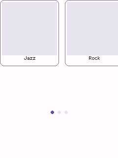

*Full sketch: [`examples/controls/carousel/carousel.ino`](../examples/controls/carousel/carousel.ino)*

### `Container`

A widget that holds child widgets and scrolls its own content vertically once it overflows its own bounds - the nestable counterpart to `Screen`'s own scrolling. Unlike the [layout calculators](#layouts) above (which only compute rects and are consumed before construction), `Container` is a real `Widget`: it owns a child list, and since it's a `Widget` itself, one `Container` can hold another, nesting arbitrarily deep.

**Guidelines**

- Children are registered with `addChild()`, not owned (same non-owning-reference convention as `Dialog`'s actions or `Drawer`'s items) - author each child's `Bounds` starting at/near the container's own `bounds.y`, exactly as you would for `Screen::addWidget()`.
- Give the `Container` its own `Bounds` shorter than its children's combined height to make it scroll; if everything fits, scrolling never engages, same as `Screen`.
- A child scrolled partially past the container's own edge is cropped to it, not drawn in full or skipped, and a `Slider` nested inside one (at any nesting depth) is still correctly recognized as draggable by `Screen::isDraggableAt()`. Scrolling itself is still vertical-only, one axis, same as `Screen`.
- Add it to `Screen` the same way as any other widget (`addWidget()`/`addFixedWidget()`); it forwards gestures and scroll internally to whichever child (or nested `Container`) they land on.
- For a list too large to keep every child `Widget` resident in memory, see the [Container - Virtualized content](#container---virtualized-content) chapter.

```cpp
// --- Container (the control under test) ---------------------------------------
// Shorter than its children's combined height, so it scrolls; nestedPanel is
// itself a Container, showing that they nest.
Container<RGB565> demoContainer(Bounds(0, 0, app.width(), 260));
Button<RGB565> buttonA(Bounds(20, 16, app.width() - 40, 48), "Button A");
Container<RGB565> nestedPanel(Bounds(20, 136, app.width() - 40, 120));
Card<RGB565> nestedCard(Bounds(0, 0, app.width() - 40, 100), "Nested", "Lives inside nestedPanel.");

// setup():
nestedPanel.addChild(nestedCard);
demoContainer.addChild(buttonA);
demoContainer.addChild(nestedPanel);
app.screen().addWidget(demoContainer);
```

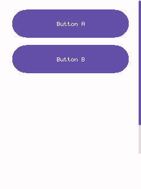

*Full sketch: [`examples/controls/container/container.ino`](../examples/controls/container/container.ino)*

### Container - Virtualized content

`addChild()` needs every item's `Widget` to exist and stay resident for as long as it's registered - fine for a screenful of content, but not for a list of thousands of rows on a board with a few hundred KB of RAM. `setChildProvider()` is the alternative: instead of a stored list, you give a `Container` two callbacks -

- a **count** function returning how many logical items there are (it can be huge - the callback is the only thing that scales, not memory), and
- an **at(index)** function returning a **reference** to the `Widget` representing that index.

The point is that `at()` doesn't have to construct a new object per index - the usual approach is a small fixed pool of real widgets (4-15, say) that `at()` repositions and relabels for whichever index is asked for, the same "recycler" pattern list views use everywhere. Setting a provider takes over completely: any children already added via `addChild()` are ignored while it's active.

The example below is a real, runnable sketch: a `Container` that reports **10,000** rows and scrolls through all of them, backed by a pool of only **12** real `ListItem` widgets - roughly a thousand-to-one reduction versus what `addChild()`-ing 10,000 `ListItem`s (each owning a `std::string` title and a `std::function` callback) would cost.

```cpp
// --- Virtualized list (the control under test) ------------------------------
constexpr int32_t kAppBarHeight = 56;
constexpr int32_t kRowHeight = 40;
constexpr int kLogicalCount = 10000;  // how many rows the list *reports*
constexpr size_t kPoolSize = 12;      // how many ListItem widgets actually exist

AppBar<RGB565> appBar(Bounds(0, 0, app.width(), kAppBarHeight), "10,000 Rows");
Container<RGB565> bigList(Bounds(0, kAppBarHeight, app.width(), app.height() - kAppBarHeight));
ListItem<RGB565> pool[kPoolSize];  // whichever ~8 rows are visible reuse these 12

// setup():
// O(1) content-height/scroll-range math instead of visiting all 10,000
// logical rows on every frame - see Container::setUniformItemHeight().
bigList.setUniformItemHeight(kRowHeight);

bigList.setChildProvider(
    []() { return kLogicalCount; },
    [](int index) -> Widget<RGB565>& {
      ListItem<RGB565>& item = pool[static_cast<size_t>(index) % kPoolSize];
      item.bounds = Bounds(bigList.bounds.x, bigList.bounds.y + index * kRowHeight,
                           bigList.bounds.w, kRowHeight);
      char label[24];
      snprintf(label, sizeof(label), "Row %d", index);
      item.setTitle(label);
      item.onClick = [index]() { printf("Row %d tapped\n", index); };
      return item;
    });

app.screen().addFixedWidget(appBar);
app.screen().addWidget(bigList);
```

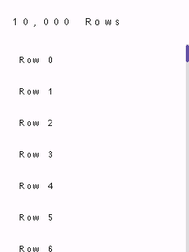

*Full sketch: [`examples/controls/virtualized-list/virtualized-list.ino`](../examples/controls/virtualized-list/virtualized-list.ino)*

**Guidelines**

- Every provider-returned widget is themed automatically the moment it's fetched (there's no fixed set to cascade `setTheme()` to ahead of time), so you don't need to call `setTheme()` on pool widgets yourself.
- `at()` is called once per index per pass (draw, hit-test, gesture dispatch, and `contentHeight()`'s scroll-range calculation all call it independently) - keep it cheap, especially with a large count. Call `setUniformItemHeight()` (as the example does) if every row is the same height, so `contentHeight()`/`clampScroll()` become an O(1) calculation instead of fetching and measuring all 10,000 rows on every single frame.
- **Caution with continuous gestures**: a drag/scroll latches the `Widget*` `at()` returned at the gesture's start and keeps calling methods on it through the rest of the gesture (`kChanged`/`kEnded`). Don't let your pool reassign that same slot to a different index while a gesture is still in progress, or the drag will end up operating on the wrong logical item.
- Available the same way on `Screen` (`setContentProvider()`, for the root scrollable area), `Dialog`/`Banner` (`setActionProvider()`), `Carousel` (`setItemProvider()`, which also re-applies `itemRect(index)` to whatever `at()` returns on every fetch), and `Drawer`/`BottomSheet`/`Menu` (`setItemProvider()`, which just forwards to their own internal `Container`).

### `ListItem`

A tappable row: optional leading icon + title, with a selected state. The building block for `Drawer`, but usable standalone for any settings-style list.

**Guidelines**

- Selected items draw as a filled pill (Material's navigation-drawer look); unselected items are flat.
- `setTypographyRole()` lets a dense list (many rows, e.g. inside a `Drawer`) use `kLabel` instead of the default `kBody`.

```cpp
// --- ListItem (the control under test) ---------------------------------------
ListItem<RGB565> demoListItem(Bounds(20, (app.height() - 48) / 2, app.width() - 40, 48), "Settings");

// setup():
demoListItem.onClick = []() { printf("List item tapped\n"); };
app.screen().addWidget(demoListItem);
```


*Full sketch: [`examples/controls/list-item/list-item.ino`](../examples/controls/list-item/list-item.ino)*

### `Divider`

A themed hairline that separates content into sections. Orientation follows the bounds' aspect ratio: wider-than-tall draws horizontal, taller-than-wide draws vertical.

**Guidelines**

- Use sparingly - Material 3 leans on spacing and grouping over explicit rules; reach for a `Divider` mainly between logically distinct sections of a scrolling list.

```cpp
// --- Divider (the control under test) ---------------------------------------
Divider<RGB565> demoDivider(Bounds(20, (app.height() - 2) / 2, app.width() - 40, 2));

// setup():
app.screen().addWidget(demoDivider);
```


*Full sketch: [`examples/controls/divider/divider.ino`](../examples/controls/divider/divider.ino)*

### `Label`

Non-interactive themed text at one of four typography roles (`kHeadline`/`kTitle`/`kBody`/`kLabel`), left- or center-aligned.

**Guidelines**

- Pick the typography role for the text's semantic weight, not just its size - `kTitle` for section headers, `kBody` for regular copy, `kLabel` for compact captions/chips-adjacent text.
- `setColor()` overrides the default `onSurface` color when a label needs to stand out (a status message in the theme's error/primary color, say).

```cpp
// --- Label (the control under test) -----------------------------------------
Label<RGB565> demoLabel(Bounds(20, (app.height() - 24) / 2, app.width() - 40, 24), "Hello, Material Design!",
                        TypographyRole::kTitle, TextAlign::kCenter);

// setup():
app.screen().addWidget(demoLabel);
```


*Full sketch: [`examples/controls/label/label.ino`](../examples/controls/label/label.ino)*

---

## Navigation

### `AppBar`

A top app bar: a title plus optional leading/trailing icon widgets (typically `IconButton`), registered via `Screen::addFixedWidget()` so it stays pinned to the top regardless of scroll position.

**Guidelines**

- Attach `leading`/`trailing` directly as pointer fields (see `leadingRect()`/`trailingRect()`) - do **not** also add them to `Screen` separately, or they'd be hit-tested twice.
- Use `setColorOverride()` to recolor just the bar (e.g. to reflect the active theme's primary color) without affecting the rest of the screen.

```cpp
// --- AppBar (the control under test) -----------------------------------------
// leading/trailing are plain pointer fields (see AppBar::leading/trailing) -
// the IconButtons themselves are declared here and positioned/attached in
// setup(), the same pattern kitchen-sink.ino uses.
AppBar<RGB565> demoAppBar(Bounds(0, 0, app.width(), 48), "App Bar");
IconButton<RGB565> appBarMenu;
IconButton<RGB565> appBarAdd;

// setup():
appBarMenu = IconButton<RGB565>(demoAppBar.leadingRect(), drawMenu<RGB565>);
demoAppBar.leading = &appBarMenu;
appBarMenu.onClick = []() { printf("Menu tapped\n"); };

appBarAdd = IconButton<RGB565>(demoAppBar.trailingRect(), drawPlus<RGB565>);
demoAppBar.trailing = &appBarAdd;
appBarAdd.onClick = []() { printf("Add tapped\n"); };

// Demonstrates setColorOverride(): recolors just this bar to the theme's
// primary color, independent of the rest of the screen.
demoAppBar.setColorOverride(theme.colors.primary, theme.colors.onPrimary);

app.screen().addFixedWidget(demoAppBar);
```


*Full sketch: [`examples/controls/app-bar/app-bar.ino`](../examples/controls/app-bar/app-bar.ino)*

### `TabBar`

A row of evenly-spaced exclusive-selection labels (primary tabs), with a sliding indicator under the selected one.

**Guidelines**

- Use for 2-5 top-level views of equally-important content within one screen; prefer `NavigationBar` for app-wide destinations instead of in-screen view switching.
- Tabs are plain strings added via `addTab()`, not separate child widgets.

```cpp
// --- TabBar (the control under test) -----------------------------------------
TabBar<RGB565> demoTabs(Bounds(0, (app.height() - 40) / 2, app.width(), 40));

// setup():
demoTabs.addTab("One");
demoTabs.addTab("Two");
demoTabs.addTab("Three");
demoTabs.onChange = [](int index) { printf("Tab selected: %d\n", index); };
app.screen().addWidget(demoTabs);
```


*Full sketch: [`examples/controls/tab-bar/tab-bar.ino`](../examples/controls/tab-bar/tab-bar.ino)*

### `NavigationBar`

A bottom navigation bar: 3-5 exclusive destinations, each an icon with a label underneath and a pill highlight behind the selected one. Pin it with `Screen::addFixedWidget()`.

**Guidelines**

- Use for an app's top-level, always-visible destinations (3-5 of them); for a tablet/landscape layout prefer `NavigationRail` instead.
- Keep labels short - they're drawn at the theme's `kLabel` typography role, meant for a word or two, not a phrase.

```cpp
// --- NavigationBar (the control under test) ----------------------------------
NavigationBar<RGB565> demoNavBar(Bounds(0, app.height() - 64, app.width(), 64));

// setup():
demoNavBar.addDestination(drawPlus<RGB565>, "Add");
demoNavBar.addDestination(drawMinus<RGB565>, "Remove");
demoNavBar.addDestination(drawMenu<RGB565>, "More");
demoNavBar.onChange = [](int index) { printf("Nav destination: %d\n", index); };
app.screen().addFixedWidget(demoNavBar);
```


*Full sketch: [`examples/controls/navigation-bar/navigation-bar.ino`](../examples/controls/navigation-bar/navigation-bar.ino)*

### `NavigationRail`

A narrow vertical column of 3-7 exclusive destinations - the tablet/landscape counterpart of `NavigationBar`, pinned to a screen edge via `Screen::addFixedWidget()`.

**Guidelines**

- Use in place of `NavigationBar` on wider/landscape layouts where a side column reads more naturally than a bottom bar.

```cpp
// --- NavigationRail (the control under test) ---------------------------------
NavigationRail<RGB565> demoNavRail(Bounds(0, 0, 72, app.height()));

// setup():
demoNavRail.addDestination(drawPlus<RGB565>, "Add");
demoNavRail.addDestination(drawMinus<RGB565>, "Remove");
demoNavRail.addDestination(drawMenu<RGB565>, "More");
demoNavRail.onChange = [](int index) { printf("Nav destination: %d\n", index); };
app.screen().addFixedWidget(demoNavRail);
```


*Full sketch: [`examples/controls/navigation-rail/navigation-rail.ino`](../examples/controls/navigation-rail/navigation-rail.ino)*

### `Drawer`

A modal side navigation panel holding a list of items (typically `ListItem`), shown like a `Dialog` via `Screen::presentDialog()`.

**Guidelines**

- Use for an app's top-level navigation destinations, opened from an app bar's leading menu icon (see `kitchen-sink.ino`).
- Wire `onScrimTap` to `app.screen().dismissDialog()` for tap-outside-to-close, and dismiss from each item's own `onClick` too.
- The item area scrolls automatically once items overflow the panel's height (it's a `Container` under the hood - see `Core/Container.h`), and `setItemProvider()` is available as a callback-driven alternative to `addItem()` for a long settings-style list - see [Container - Virtualized content](#container---virtualized-content) section.

```cpp
// --- Drawer (the control under test) -----------------------------------------
Drawer<RGB565> demoDrawer(Bounds(0, 0, 220, app.height()));
ListItem<RGB565> drawerItem;

// setup():
drawerItem = ListItem<RGB565>(demoDrawer.itemRect(0), "Home");
drawerItem.setSelected(true);
drawerItem.onClick = []() {
  printf("Drawer item tapped\n");
  app.screen().dismissDialog();
};
demoDrawer.addItem(drawerItem);
demoDrawer.onScrimTap = []() { app.screen().dismissDialog(); };

// Shown immediately (no separate trigger control) - see Screen::presentDialog().
app.screen().presentDialog(demoDrawer);
```


*Full sketch: [`examples/controls/drawer/drawer.ino`](../examples/controls/drawer/drawer.ino)*

### `Menu`

A popover list of items (typically `ListItem`), anchored near whatever opened it. Same modal-presentation shape as Dialog/Drawer, but - unlike them - does **not** dim the rest of the screen, since a menu is a lightweight popover, not a heavyweight interruption.

**Guidelines**

- Use for a small, contextual set of choices (a dropdown from a Button, a long-press context menu) - for full-screen navigation use `Drawer` instead.
- Wire `onOutsideTap` to `app.screen().dismissDialog()` for the expected tap-outside-to-close behavior.
- Like `Drawer`, the item area is a `Container` under the hood - it scrolls automatically if items overflow, and `setItemProvider()` is available as a callback-driven alternative to `addItem()` - see [Container - Virtualized content](#container---virtualized-content) section.

```cpp
// --- Menu (the control under test) -------------------------------------------
Menu<RGB565> demoMenu(Bounds((app.width() - 160) / 2, (app.height() - 40) / 2, 160, 40));
ListItem<RGB565> menuItem;

// setup():
menuItem = ListItem<RGB565>(demoMenu.itemRect(0), "Option 1");
menuItem.onClick = []() {
  printf("Menu item tapped\n");
  app.screen().dismissDialog();
};
demoMenu.addItem(menuItem);
demoMenu.onOutsideTap = []() { app.screen().dismissDialog(); };

// Shown immediately (no separate trigger control) - see Screen::presentDialog().
app.screen().presentDialog(demoMenu);
```


*Full sketch: [`examples/controls/menu/menu.ino`](../examples/controls/menu/menu.ino)*

### `Dialog`

A modal alert: full-screen scrim + centered card + title + wrapped message + action widgets (typically `Button`). Shown with `Screen::presentDialog()`.

**Guidelines**

- Always give a Dialog at least one action wired to `app.screen().dismissDialog()` - without one there's no way for the user to close it (this example omits that follow-up wiring for brevity beyond the one OK action shown).
- Reserve dialogs for choices that truly need to interrupt the user - for a transient, non-blocking status message use `Snackbar` instead.
- `setActionProvider()` is available as a callback-driven alternative to `addAction()` - see [Container - Virtualized content](#container---virtualized-content) section (not usually needed for a dialog's handful of actions, but available for consistency).

```cpp
// --- Dialog (the control under test) -----------------------------------------
Dialog<RGB565> demoDialog(Bounds(20, (app.height() - 160) / 2, app.width() - 40, 160), "Hello",
                          "This is a simple modal dialog with one action.");
Button<RGB565> dialogOk(Bounds(0, 0, 80, 36), "OK");

// setup():
dialogOk.bounds = demoDialog.actionRect(0, 1);
dialogOk.onClick = []() {
  printf("Dialog OK tapped\n");
  app.screen().dismissDialog();
};
demoDialog.addAction(dialogOk);

// Shown immediately (no separate trigger control) - see Screen::presentDialog().
app.screen().presentDialog(demoDialog);
```


*Full sketch: [`examples/controls/dialog/dialog.ino`](../examples/controls/dialog/dialog.ino)*

### `BottomSheet`

A modal panel sliding up from the bottom edge, full width, with rounded top corners and a drag-handle bar - Material's "modal bottom sheet". Holds a list of items the same non-owning way `Drawer` holds its items.

**Guidelines**

- Use for a focused set of actions/options related to the current context (a share sheet, a "more options" panel) - prefer `Dialog` for a yes/no-style interruption instead.
- `itemRect()` is theme-independent by design, so items can be constructed at global scope before the sheet has ever been given a theme - the same pattern `Drawer::itemRect()` uses.
- Like `Drawer`, the item area is a `Container` under the hood - it scrolls automatically if items overflow, and `setItemProvider()` is available as a callback-driven alternative to `addItem()` - see [Container - Virtualized content](#container---virtualized-content) section.

```cpp
// --- BottomSheet (the control under test) ------------------------------------
BottomSheet<RGB565> demoSheet(Bounds(0, app.height() - 160, app.width(), 160), "Options");
ListItem<RGB565> sheetItem;

// setup():
sheetItem = ListItem<RGB565>(demoSheet.itemRect(0), "Share");
sheetItem.onClick = []() {
  printf("Bottom sheet item tapped\n");
  app.screen().dismissDialog();
};
demoSheet.addItem(sheetItem);
demoSheet.onScrimTap = []() { app.screen().dismissDialog(); };

// Shown immediately (no separate trigger control) - see Screen::presentDialog().
app.screen().presentDialog(demoSheet);
```


*Full sketch: [`examples/controls/bottom-sheet/bottom-sheet.ino`](../examples/controls/bottom-sheet/bottom-sheet.ino)*

---

## Text input

### `TextField`

A single-line text input box. Only holds and displays text and focus state - it has no idea how to turn touches into characters; pair with `Keyboard` (see that example) for actual typing.

**Guidelines**

- Wire a `Keyboard` via `keyboard.manage(field)` to let the user actually type - a lone `TextField` (as shown here) can still be focused/tapped, but nothing routes keystrokes into it.
- Text longer than the box draws past its right edge rather than scrolling/clipping - fine for short inputs, not for long free-form text (use `TextArea` for that).

```cpp
// --- TextField (the control under test) ---------------------------------------
// Tap to focus (a blinking cursor appears); pair with a Keyboard (see the
// keyboard example) to actually type into it.
TextField<RGB565> demoField(Bounds(20, (app.height() - 48) / 2, app.width() - 40, 48), "Name", "Your name");

// setup():
demoField.onSubmit = []() { printf("Submitted: %s\n", demoField.text().c_str()); };
app.screen().addWidget(demoField);
```


*Full sketch: [`examples/controls/text-field/text-field.ino`](../examples/controls/text-field/text-field.ino)*

### `TextArea`

The multi-line, word-wrapped counterpart to `TextField` - same `TextInputTarget` interface, same need for a `Keyboard` to drive actual typing.

**Guidelines**

- Use for longer free-form text (notes, descriptions); use `TextField` for short single-line values (names, search terms).
- On a `Keyboard`, Enter inserts a literal newline here (unlike `TextField`, where Enter submits) - Done still closes the keyboard regardless of field type.

```cpp
// --- TextArea (the control under test) ---------------------------------------
// Tap to focus (a blinking cursor appears); pair with a Keyboard (see the
// keyboard example) to actually type into it.
TextArea<RGB565> demoArea(Bounds(20, (app.height() - 140) / 2, app.width() - 40, 140), "Notes",
                          "Write something...");

// setup():
app.screen().addWidget(demoArea);
```


*Full sketch: [`examples/controls/text-area/text-area.ino`](../examples/controls/text-area/text-area.ino)*

### `SearchBar`

A pill-shaped search input: leading magnifier glyph, typed text, and a trailing "x" clear glyph shown once there's something to clear. Implements `TextInputTarget` the same way `TextField` does.

**Guidelines**

- Pair with a `Keyboard` (via `manage()`) for actual typing, same as `TextField`/`TextArea` - omitted here to keep this a single-control demo.
- The trailing clear glyph only appears once `text()` is non-empty, and tapping it clears the field without needing a separate button.

```cpp
// --- SearchBar (the control under test) ---------------------------------------
// Tap to focus (a blinking cursor appears); pair with a Keyboard to
// actually type into it - omitted here to keep this a single-control demo.
SearchBar<RGB565> demoSearch(Bounds(20, (app.height() - 48) / 2, app.width() - 40, 48), "Search");

// setup():
demoSearch.onSubmit = []() { printf("Search submitted: %s\n", demoSearch.text().c_str()); };
app.screen().addWidget(demoSearch);
```


*Full sketch: [`examples/controls/search-bar/search-bar.ino`](../examples/controls/search-bar/search-bar.ino)*

### `Keyboard`

An on-screen QWERTY keyboard that drives one text input (`TextField` or `TextArea`) at a time. A single instance can serve any number of fields via `manage(field)`.

**Guidelines**

- Add it to `Screen` *after* every field it manages, so it draws (and hit-tests) on top of them while shown.
- Enter and Done are deliberately separate: Enter always inserts a literal newline; Done always means "finished editing" and hides the keyboard.
- This example forces it visible directly (no managed field) purely to keep it a single-control demo - keys still respond, they just have nowhere to insert characters.

```cpp
// --- Keyboard (the control under test) ---------------------------------------
// Normally shown/targeted via a TextField's/TextArea's onFocus (see
// Keyboard::manage()); forced visible here directly so this stays a
// single-control demo - keys still respond, they just have no field to
// insert characters into.
Keyboard<RGB565> demoKeyboard(Bounds(0, app.height() - 190, app.width(), 190));

// setup():
demoKeyboard.visible = true;
app.screen().addFixedWidget(demoKeyboard);
```


*Full sketch: [`examples/controls/keyboard/keyboard.ino`](../examples/controls/keyboard/keyboard.ino)*

---

## Layouts

None of these are widgets. TinyMaterialDesign deliberately has no auto-layout
container - every widget always gets an explicit `Bounds`, set once, that it
never recomputes itself. A layout class is a small calculator you use
*before* constructing/positioning widgets: it turns a container `Bounds`
plus a few numbers into the `Bounds` for each item, and you assign those
yourself.

```cpp
GridLayout grid(Bounds(16, 56, 308, 400), 90, 110);
for (size_t i = 0; i < cards.size(); ++i) cards[i].bounds = grid.cellRect(i);
```

They own nothing, allocate nothing, and hold no widget pointers - just plain
arithmetic on `Bounds`, which keeps them free on memory-constrained boards
and safe to recompute every frame if a container resizes. Pick the one that
matches the arrangement you need; several can be combined (e.g. `SplitLayout`
to carve out a pane, then `GridLayout` inside it).

If you actually need a widget that *owns* a scrollable/nestable set of
children rather than just computing where to put them, see
[`Container`](#container) in the Containment chapter - it's a real `Widget`,
not a calculator, and is the one exception to "no widget owns its children"
in this list.

### `GridLayout`

Wraps a row of equal-size cells to fit a container's width - the classic "N cards per row" grid (station/genre tiles, a dashboard of `MediaCard`s).

**Guidelines**

- As many columns as fit the container's width are used automatically; you don't specify a column count.
- Rows are *not* clipped to the container's height - use `totalHeight(count)` to size a scroll area.

```cpp
// --- GridLayout (the control under test) ------------------------------------
GridLayout demoGrid(Bounds(10, 20, app.width() - 20, app.height() - 40), /*cellWidth=*/100, /*cellHeight=*/70);
Button<RGB565> cellA(Bounds(), "1");
Button<RGB565> cellB(Bounds(), "2");
Button<RGB565> cellC(Bounds(), "3");
Button<RGB565> cellD(Bounds(), "4");
Button<RGB565>* cells[] = {&cellA, &cellB, &cellC, &cellD};

// setup():
for (size_t i = 0; i < 4; ++i) {
  cells[i]->bounds = demoGrid.cellRect(static_cast<int>(i));
  app.screen().addWidget(*cells[i]);
}
```

*Header: [`Core/GridLayout.h`](../src/TinyMaterialDesign/Core/GridLayout.h)*

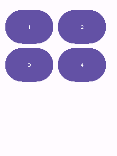

*Full sketch: [`examples/layouts/grid-layout/grid-layout.ino`](../examples/layouts/grid-layout/grid-layout.ino)*

### `LinearLayout`

Splits a container into equal or weighted slices along one axis - a row of buttons, a column of stacked panels.

**Guidelines**

- Default is an equal split of `count` items minus spacing gutters.
- Pass a `weights` array to give some items more of the remaining space than others (weights are relative, not required to sum to 1).

```cpp
// --- LinearLayout (the control under test) ----------------------------------
LinearLayout demoRow(Bounds(10, (app.height() - 48) / 2, app.width() - 20, 48), LayoutAxis::Horizontal);
Button<RGB565> buttonA(Bounds(), "A");
Button<RGB565> buttonB(Bounds(), "B (2x)");
Button<RGB565> buttonC(Bounds(), "C");

// setup():
float weights[] = {1.0f, 2.0f, 1.0f};
buttonA.bounds = demoRow.itemRect(0, weights, 3);
buttonB.bounds = demoRow.itemRect(1, weights, 3);
buttonC.bounds = demoRow.itemRect(2, weights, 3);
app.screen().addWidget(buttonA);
app.screen().addWidget(buttonB);
app.screen().addWidget(buttonC);
```

*Header: [`Core/LinearLayout.h`](../src/TinyMaterialDesign/Core/LinearLayout.h)*

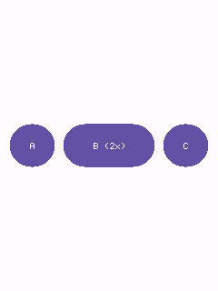

*Full sketch: [`examples/layouts/linear-layout/linear-layout.ino`](../examples/layouts/linear-layout/linear-layout.ino)*

### `FlowLayout`

Packs items of varying width left-to-right, wrapping to a new row when one would overflow - a chip/tag group whose item count and widths aren't known up front.

**Guidelines**

- Each item reports its own width/height to `next()`; calls must be made in order since each one advances an internal cursor.
- Call `reset()` to run the same set of items again, and `totalHeight()` after a full pass to size a scroll area.

```cpp
// --- FlowLayout (the control under test) ------------------------------------
FlowLayout demoFlow(Bounds(10, 20, app.width() - 20, app.height() - 40));
Chip<RGB565> chipJazz(Bounds(), "Jazz");
Chip<RGB565> chipRock(Bounds(), "Rock");
Chip<RGB565> chipClassical(Bounds(), "Classical");
Chip<RGB565> chipPop(Bounds(), "Pop");
Chip<RGB565> chipHipHop(Bounds(), "Hip-Hop");
Chip<RGB565> chipElectronic(Bounds(), "Electronic");
Chip<RGB565>* chips[] = {&chipJazz, &chipRock, &chipClassical, &chipPop, &chipHipHop, &chipElectronic};
constexpr int32_t kChipWidths[] = {60, 60, 90, 60, 80, 100};

// setup():
for (size_t i = 0; i < 6; ++i) {
  chips[i]->bounds = demoFlow.next(kChipWidths[i], /*height=*/36);
  app.screen().addWidget(*chips[i]);
}
```

*Header: [`Core/FlowLayout.h`](../src/TinyMaterialDesign/Core/FlowLayout.h)*

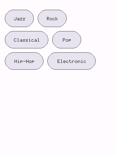

*Full sketch: [`examples/layouts/flow-layout/flow-layout.ino`](../examples/layouts/flow-layout/flow-layout.ino)*

### `SplitLayout`

Divides a container into two panes along one axis - a nav/content or master/detail split on a larger display.

**Guidelines**

- Construct with a fixed pixel size for the first pane, or use `SplitLayout::ratio(...)` for a proportional split (e.g. 0.3f for 30/70).
- The second pane fills the remainder minus the gutter.

```cpp
// --- SplitLayout (the control under test) -----------------------------------
Card<RGB565> navCard(Bounds(), "Nav", "35%");
Card<RGB565> contentCard(Bounds(), "Content", "The remaining 65%, minus the gutter.");

// setup():
SplitLayout demoSplit =
    SplitLayout::ratio(Bounds(0, 20, app.width(), app.height() - 40), LayoutAxis::Horizontal, 0.35f);
navCard.bounds = demoSplit.firstRect();
contentCard.bounds = demoSplit.secondRect();
app.screen().addWidget(navCard);
app.screen().addWidget(contentCard);
```

*Header: [`Core/SplitLayout.h`](../src/TinyMaterialDesign/Core/SplitLayout.h)*

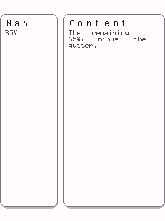

*Full sketch: [`examples/layouts/split-layout/split-layout.ino`](../examples/layouts/split-layout/split-layout.ino)*

### `AnchorLayout`

Positions a single rect relative to a corner or edge of a container - a FAB pinned to the bottom-right, a badge pinned to the top-right corner of an avatar.

**Guidelines**

- `margin` insets the anchored rect from the container edge; pass `0` to flush it against the edge.
- Combine with `Screen`'s own `Bounds` to anchor relative to the whole screen rather than a widget.

```cpp
// --- AnchorLayout (the control under test) ----------------------------------
Card<RGB565> backgroundCard(Bounds(10, 10, app.width() - 20, app.height() - 20), "AnchorLayout",
                            "Badge anchored to my corner; FAB anchored to the screen's.");
Badge<RGB565> cornerBadge(Bounds(), "3");
FAB demoFab(Bounds(), drawPlus<RGB565>);

// setup():
AnchorLayout cardAnchor(backgroundCard.bounds);
cornerBadge.bounds = cardAnchor.rect(Anchor::TopRight, 24, 24);

AnchorLayout screenAnchor(Bounds(0, 0, app.width(), app.height()), /*margin=*/16);
demoFab.bounds = screenAnchor.rect(Anchor::BottomRight, 56, 56);

app.screen().addWidget(backgroundCard);
app.screen().addWidget(cornerBadge);
app.screen().addWidget(demoFab);
```

*Header: [`Core/AnchorLayout.h`](../src/TinyMaterialDesign/Core/AnchorLayout.h)*

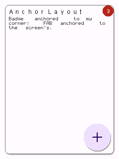

*Full sketch: [`examples/layouts/anchor-layout/anchor-layout.ino`](../examples/layouts/anchor-layout/anchor-layout.ino)*

### `StackLayout`

`StackLayout` actually bundles two unrelated, single-purpose helpers under one name - it's not "arrange these into a row/column" (that's `LinearLayout`), it's "place one rect relative to another rect it sits on top of or overlaps":

- **`centered(width, height)`** - centers one rect in the middle of a container. Use this for an icon centered inside a bigger button/panel.
- **`offset(index, width, height)`** - places the `index`-th of a series of same-size rects, each shifted `overlapStep` pixels from the previous one, starting at the container's `(x, y)` origin. This is the classic "overlapping avatar stack" you see in group chats or "shared with" lists: a handful of profile pictures fanned out so each shows a sliver of itself peeking out from behind the next.

A single `StackLayout` instance is normally used for just one of these, not both - the example below constructs two separate instances only because it's demonstrating both methods in one sketch.

**Guidelines**

- `centered()` ignores `overlapStep` entirely - that constructor argument only matters to `offset()`.
- `offset()` never reads the container's `width`/`height`, only its `x`/`y` origin - so when you're only using `offset()`, it's fine (and clearer) to construct the `StackLayout` with a `0x0` container size, as in the second snippet below; there's no "real" container to speak of, just a starting point.
- `offset()`'s "overlap" is a fixed pixel step along x, not a percentage - pick a step smaller than `width` to actually get visual overlap (e.g. `width=48, overlapStep=28` leaves each chip showing ~28px of itself before the next one covers the rest).

```cpp
// --- StackLayout: centered() --------------------------------------------------
// One icon, centered inside a larger card.
Card<RGB565> panel(Bounds(10, 30, app.width() - 20, 90), nullptr, nullptr);
IconButton<RGB565> centeredIcon(Bounds(), drawPlus<RGB565>, IconButtonVariant::kFilled);

// setup():
StackLayout iconStack(panel.bounds);
centeredIcon.bounds = iconStack.centered(48, 48);
```

```cpp
// --- StackLayout: offset() -----------------------------------------------------
// Three plain colored circles (standing in for profile pictures), each
// shifted 28px from the last, fanning out from (30, 160) into an
// overlapping row - a circular IconButton is what sells the "avatar
// stack" look here; the same offsets applied to a rectangular Button
// would just look like clipped corners instead.
IconButton<RGB565> avatarA(Bounds(), nullptr, IconButtonVariant::kFilled);
IconButton<RGB565> avatarB(Bounds(), nullptr, IconButtonVariant::kFilled);
IconButton<RGB565> avatarC(Bounds(), nullptr, IconButtonVariant::kFilled);
IconButton<RGB565>* avatars[] = {&avatarA, &avatarB, &avatarC};

// setup():
// Only the (30, 160) origin matters here - width/height are ignored by
// offset(), so they're left at 0 rather than a real container size.
StackLayout avatarStack(Bounds(30, 160, 0, 0), /*overlapStep=*/28);
RGB565 avatarColors[] = {theme.colors.primary, theme.colors.secondary, theme.colors.error};
for (size_t i = 0; i < 3; ++i) {
  avatars[i]->bounds = avatarStack.offset(static_cast<int>(i), 48, 48);
  avatars[i]->setColorOverride(avatarColors[i], theme.colors.onPrimary);
}
```

*Header: [`Core/StackLayout.h`](../src/TinyMaterialDesign/Core/StackLayout.h)*

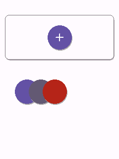

*Full sketch: [`examples/layouts/stack-layout/stack-layout.ino`](../examples/layouts/stack-layout/stack-layout.ino)*

### `RadialLayout`

Places item rects evenly spaced around a circle - dial/menu items on a round display, where rectilinear packing doesn't match the screen shape.

**Guidelines**

- Angle 0 points up (12 o'clock) and items are placed clockwise, like a clock face; rotate the whole ring with `startDegrees`.
- `radius` is measured from the container's center to each item's center point.

```cpp
// --- RadialLayout (the control under test) ----------------------------------
RadialLayout demoDial(Bounds(0, 40, app.width(), app.width()), /*radius=*/90);
Button<RGB565> item0(Bounds(), "12");
Button<RGB565> item1(Bounds(), "2");
Button<RGB565> item2(Bounds(), "4");
Button<RGB565> item3(Bounds(), "6");
Button<RGB565> item4(Bounds(), "8");
Button<RGB565> item5(Bounds(), "10");
Button<RGB565>* items[] = {&item0, &item1, &item2, &item3, &item4, &item5};

// setup():
for (size_t i = 0; i < 6; ++i) {
  items[i]->bounds = demoDial.itemRect(static_cast<int>(i), 6, /*width=*/40, /*height=*/40);
  app.screen().addWidget(*items[i]);
}
```

*Header: [`Core/RadialLayout.h`](../src/TinyMaterialDesign/Core/RadialLayout.h)*

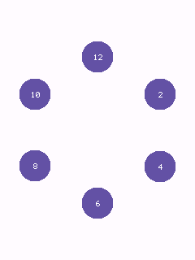

*Full sketch: [`examples/layouts/radial-layout/radial-layout.ino`](../examples/layouts/radial-layout/radial-layout.ino)*

### `TableLayout`

A grid with independently-sized columns and rows, for dashboards mixing wide/narrow columns or short/tall rows - `GridLayout` assumes uniform cells, `TableLayout` doesn't.

**Guidelines**

- Column widths and row heights are supplied as plain arrays, sized to `columnCount`/`rowCount`.
- Use `totalWidth()`/`totalHeight()` to size the container that holds the table.

```cpp
// --- TableLayout (the control under test) -----------------------------------
constexpr int32_t kColumnWidths[] = {150, 60};
constexpr int32_t kRowHeights[] = {70, 70, 70};
TableLayout demoTable(Bounds(10, 20, app.width() - 20, app.height() - 40), kColumnWidths, 2, kRowHeights, 3);

Card<RGB565> wide0(Bounds(), "Wide", "Row 0");
Card<RGB565> narrow0(Bounds(), "N", nullptr);
Card<RGB565> wide1(Bounds(), "Wide", "Row 1");
Card<RGB565> narrow1(Bounds(), "N", nullptr);
Card<RGB565> wide2(Bounds(), "Wide", "Row 2");
Card<RGB565> narrow2(Bounds(), "N", nullptr);

// setup():
wide0.bounds = demoTable.cellRect(0, 0);
narrow0.bounds = demoTable.cellRect(0, 1);
wide1.bounds = demoTable.cellRect(1, 0);
narrow1.bounds = demoTable.cellRect(1, 1);
wide2.bounds = demoTable.cellRect(2, 0);
narrow2.bounds = demoTable.cellRect(2, 1);

app.screen().addWidget(wide0);
app.screen().addWidget(narrow0);
app.screen().addWidget(wide1);
app.screen().addWidget(narrow1);
app.screen().addWidget(wide2);
app.screen().addWidget(narrow2);
```

*Header: [`Core/TableLayout.h`](../src/TinyMaterialDesign/Core/TableLayout.h)*

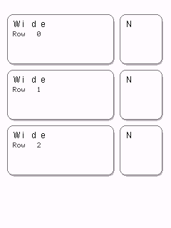

*Full sketch: [`examples/layouts/table-layout/table-layout.ino`](../examples/layouts/table-layout/table-layout.ino)*

---


## Building and running the examples

```sh
cmake -B build -S .
cmake --build build --target button   # or any other control's directory name
./build/examples/controls/button/button
```

See [`examples/kitchen-sink`](../examples/kitchen-sink) for all of the
original widgets combined into one scrollable screen, and
[`examples/controls/README.md`](../examples/controls/README.md) for the full
one-sketch-per-widget list.
