# TinyMaterialDesign Tutorial

## Introduction

TinyMaterialDesign is a header-only Arduino/C++ library that implements the
most important [Material Design 3](https://m3.material.io/) GUI components
on top of [TinyGPU](https://github.com/pschatzmann/TinyGPU) - TinyGPU
supplies the pixel surfaces (`ISurface<RGB_T>`) and the touch input stack
(`TouchDriver`/`GestureDetector`); TinyMaterialDesign supplies the widgets
and draws them.

Everything here is a template over `RGB_T` (`RGB565`/`RGB666`/`RGB888`),
matching TinyGPU's own convention - pick whichever pixel format matches your
panel and every widget, theme, and helper follows.

### Core concepts

- **`Widget<RGB_T>`** is the base class every control derives from. It owns
  a `Bounds` rect, `visible`/`enabled` flags, and implements `draw()` (and,
  for interactive controls, `onGesture()`/`update()`).
- **`MaterialTheme<RGB_T>`** bundles a `ColorScheme` (Material 3 color
  roles), shape (corner radius) tokens, an 8px spacing unit, and 4
  typography roles backed by TinyGPU's bitmap fonts. `defaultTheme()`/
  `defaultDarkTheme()` and named seed-hue presets (`blueTheme()`,
  `greenTheme()`, `redTheme()`, `orangeTheme()`, each with a `*DarkTheme()`
  counterpart) are ready to use out of the box - see `Theme/MaterialTheme.h`.
- **`Screen<RGB_T>`** owns your widgets, draws them each frame, and routes
  gesture events to the right one. Widgets added via `addWidget()` scroll as
  a group when content is taller than the surface; `addFixedWidget()` pins a
  widget (an `AppBar`, a bottom `Keyboard`/`NavigationBar`) to its own
  screen position regardless of scroll. `presentDialog()` shows any widget
  modally (`Dialog`, `Drawer`, `Menu`, `BottomSheet` all use this).

### The shared sketch skeleton

Every example below (and every sketch under `examples/controls/`) follows
the same shape - construct a `Surface`, a `Screen`, wire up
`GestureDetector`, register widgets, then per-frame `update()`/`draw()`:

```cpp
#include <TinyMaterialDesign.h>
#include <TinyGPU/Boards/LCDBoards.h>

constexpr size_t kWidth = 240;
constexpr size_t kHeight = 320;

#ifdef ESP32
LCDBoardGuitionESP32_LVGL_2_4Display board;
#else
LCDBoardDesktopSDL board(kWidth, kHeight);  // desktop preview, no touch hardware needed
#endif
Surface<RGB565> surface(kWidth, kHeight, FontRGB565);
DeviceOutput<RGB565> display(board.display());

GestureDetector gestures;
MaterialTheme<RGB565> theme = defaultTheme<RGB565>();
Screen<RGB565> screen(theme);

// ... one or more widgets declared here ...

void setup() {
  board.begin();
  display.begin();
  surface.begin();

  // ... wire callbacks, screen.addWidget()/addFixedWidget()/presentDialog() ...

  gestures.onGesture = [](GestureEvent& event) { screen.handleGesture(event); };
  gestures.isDraggable = [](int16_t x, int16_t y) { return screen.isDraggableAt(x, y); };
}

void loop() {
  gestures.update(*board.touch());
  screen.update(millis());
  if (screen.isDirty()) {   // skip redraw/display-write on an idle frame
    screen.draw(surface);
    display.writeData(surface);
  }
}
```

The per-control sections below only show the parts that differ - the
widget's own declaration and its `setup()` wiring - and link to the full,
runnable sketch under `examples/controls/<name>/`. Every screenshot was
rendered directly from that same sketch's widget setup, at the library's
reference 240x320 size.

---

## Actions

### `Button`

A tappable pill-shaped control that triggers a single action, in one of five Material 3 styles: Filled, Tonal, Outlined, Text, and Elevated. Tapping it grows a ripple from the tap point (see `theme.enableRipple`) as touch feedback.

**Guidelines**

- Use **Filled** for the single highest-emphasis action on a screen (e.g. "Submit"); it has the strongest visual weight.
- Use **Tonal** for a secondary, still-prominent action that shouldn't compete with a Filled button on the same screen.
- Use **Outlined** or **Text** for lower-emphasis actions, typically alongside a Filled/Tonal button (e.g. Dialog's Cancel/OK pair).
- Use **Elevated** sparingly - its drop shadow implies it floats above the surface, which reads oddly if everything around it does too.
- Set `enabled = false` rather than removing the widget to show a temporarily unavailable action; disabled buttons are drawn dimmed and stop reacting to taps.

```cpp
// --- Button (the control under test) --------------------------------------
Button<RGB565> demoButton(Bounds((kWidth - 120) / 2, (kHeight - 40) / 2, 120, 40), "Tap me");

// setup():
demoButton.onClick = []() { printf("Button tapped\n"); };
screen.addWidget(demoButton);
```

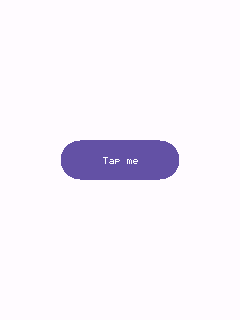

*Full sketch: [`examples/controls/button/button.ino`](../examples/controls/button/button.ino)*

### `IconButton`

A circular tap target hosting one vector glyph from `Draw/Icons.h` (or any function matching `IconPainter`). `kStandard` is a flat toolbar-style icon; `kFilled`/`kTonal` add a colored, elevated circular background.

**Guidelines**

- Use `kStandard` for app bar / toolbar icons that sit directly on the surface color.
- Use `kFilled`/`kTonal` for a smaller status-dependent circular action (e.g. a play/stop toggle) - pair with `setColorOverride()` to recolor it live (green while idle, red while active).
- For a dedicated Floating Action Button (bigger, with its own elevation shadow and an optional label), use `Fab.h`'s `FloatingActionButton`/`FAB` instead.
- `setThemeTint()` lets a container (AppBar) push ambient colors onto an IconButton it hosts, without the button needing its own explicit override.

```cpp
// --- IconButton (the control under test) -----------------------------------
IconButton<RGB565> demoIconButton(Bounds((kWidth - 56) / 2, (kHeight - 56) / 2, 56, 56),
                                  drawPlus<RGB565>, IconButtonVariant::kFilled);

// setup():
demoIconButton.onClick = []() { printf("Icon button tapped\n"); };
screen.addWidget(demoIconButton);
```

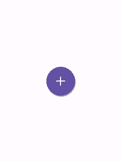

*Full sketch: [`examples/controls/icon-button/icon-button.ino`](../examples/controls/icon-button/icon-button.ino)*

### `FloatingActionButton` (alias `FAB`)

The Floating Action Button: a circular (or pill-shaped "extended" form, when constructed with a label) elevated button for a screen's single primary action.

**Guidelines**

- Give a screen at most one FAB - it represents *the* primary action, not one of several.
- Use the circular form (40x40 small / 56x56 regular / 96x96 large) when space is tight; use the extended pill form (icon + label) when the action benefits from a text hint.
- Pick `FabColor::kPrimary` (the default) for most cases; `kSurface` reads as lower-emphasis when a screen already has strong primary-colored content elsewhere.

```cpp
// --- FloatingActionButton / FAB (the control under test) -------------------
FAB demoFab(Bounds((kWidth - 140) / 2, (kHeight - 56) / 2, 140, 56), drawPlus<RGB565>, "Add");

// setup():
demoFab.onClick = []() { printf("FAB tapped\n"); };
screen.addWidget(demoFab);
```

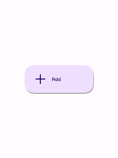

*Full sketch: [`examples/controls/fab/fab.ino`](../examples/controls/fab/fab.ino)*

### `Chip`

A small rounded-rect label, optionally a toggle ("filter chip") rather than a one-shot action ("assist chip").

**Guidelines**

- Set `selectable = true` for filter/choice chips the user toggles (a color-scheme picker, as in `kitchen-sink.ino`); leave it `false` for a chip that just fires `onClick` once, like a small action button.
- Group several selectable chips together for a compact multi/single-choice filter row - `Chip` doesn't coordinate mutual exclusion itself (wire that in `onChange`, as needed).

```cpp
// --- Chip (the control under test) -------------------------------------------
Chip<RGB565> demoChip(Bounds((kWidth - 100) / 2, (kHeight - 32) / 2, 100, 32), "Filter",
                      /*selectable=*/true);

// setup():
demoChip.onChange = [](bool selected) { printf("Chip: %s\n", selected ? "selected" : "unselected"); };
screen.addWidget(demoChip);
```

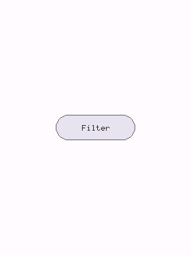

*Full sketch: [`examples/controls/chip/chip.ino`](../examples/controls/chip/chip.ino)*

---

## Selection & input

### `Checkbox`

A square box toggled by tap, for one independent on/off choice (as opposed to `RadioButton`'s mutually-exclusive choice within a group).

**Guidelines**

- Use for choices that are independent of each other ("Enable notifications") - use `RadioButton`/`RadioGroup` instead when only one of several options can be selected.
- Pair with a `Label` placed to its right rather than relying on the checkbox's own (nonexistent) text - tapping the label itself doesn't toggle the box unless you wire that yourself.

```cpp
// --- Checkbox (the control under test) --------------------------------------
Checkbox<RGB565> demoCheckbox(Bounds((kWidth - 24) / 2, (kHeight - 24) / 2, 24, 24), true);

// setup():
demoCheckbox.onChange = [](bool checked) { printf("Checkbox: %s\n", checked ? "checked" : "unchecked"); };
screen.addWidget(demoCheckbox);
```

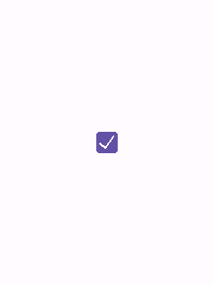

*Full sketch: [`examples/controls/checkbox/checkbox.ino`](../examples/controls/checkbox/checkbox.ino)*

### `Switch`

A track-and-thumb toggle, Material's alternative to `Checkbox` for a single on/off setting - conventionally used for settings that take effect immediately, rather than ones a form is later submitted with.

**Guidelines**

- Prefer `Switch` over `Checkbox` for settings screens ("Dark theme", "Wi-Fi") where the change applies right away; prefer `Checkbox` inside forms/lists with an explicit submit step.
- Only tap-to-toggle is implemented (no drag-to-slide yet).

```cpp
// --- Switch (the control under test) ----------------------------------------
Switch<RGB565> demoSwitch(Bounds((kWidth - 48) / 2, (kHeight - 28) / 2, 48, 28));

// setup():
demoSwitch.onChange = [](bool value) { printf("Switch: %s\n", value ? "on" : "off"); };
screen.addWidget(demoSwitch);
```

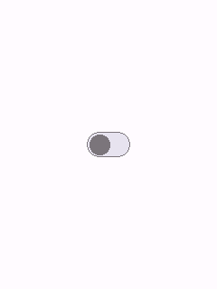

*Full sketch: [`examples/controls/switch/switch.ino`](../examples/controls/switch/switch.ino)*

### `RadioButton` + `RadioGroup`

One radio button never deselects itself on tap (radio semantics); `RadioGroup` (not itself a `Widget`) coordinates a set of them so selecting one deselects the rest.

**Guidelines**

- Always use at least 2 `RadioButton`s together via a `RadioGroup` in real usage - a lone one (as shown here) can only ever become selected, never deselected, which is correct radio behavior but not a meaningful choice on its own.
- Each button still needs `screen.addWidget()`'d individually - `RadioGroup` only wires the mutual-exclusion logic, it doesn't register anything with `Screen`.

```cpp
// --- RadioButton (the control under test) -----------------------------------
// A lone RadioButton never deselects itself on tap (radio semantics) -
// mutual exclusion across a group is RadioGroup's job, not shown here.
RadioButton<RGB565> demoRadio(Bounds((kWidth - 24) / 2, (kHeight - 24) / 2, 24, 24));

// setup():
demoRadio.onSelected = []() { printf("Radio selected\n"); };
screen.addWidget(demoRadio);
```

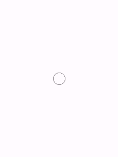

*Full sketch: [`examples/controls/radio-button/radio-button.ino`](../examples/controls/radio-button/radio-button.ino)*

### `Slider`

A draggable track-and-thumb control over a `[minValue, maxValue]` range. Tapping the track jumps the thumb there; dragging tracks the finger continuously, even past the slider's own bounds once a drag has started.

**Guidelines**

- Reports `isDraggable() == true` - make sure `Screen::isDraggableAt()` is wired to `GestureDetector::isDraggable` (as every example here does) or dragging won't be recognized.
- Show the live value next to the slider (a `Label` updated from `onChange`) so the current setting is legible without needing to inspect the thumb position precisely.

```cpp
// --- Slider (the control under test) ----------------------------------------
Slider<RGB565> demoSlider(Bounds(20, (kHeight - 24) / 2, kWidth - 40, 24), 0.0f, 100.0f, 40.0f);

// setup():
demoSlider.onChange = [](float value) { printf("Slider: %d\n", static_cast<int>(value)); };
screen.addWidget(demoSlider);
```

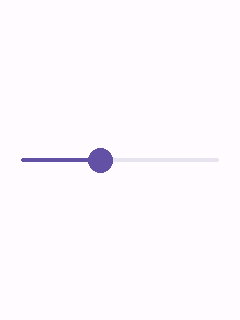

*Full sketch: [`examples/controls/slider/slider.ino`](../examples/controls/slider/slider.ino)*

### `SegmentedButton`

A row of segments sharing one pill-shaped outline - Material's "segmented button", for choosing among a small set of related options shown side by side. Single-select (radio-like, the default) or multi-select via `setMultiSelect(true)`.

**Guidelines**

- Use for 2-5 closely related, mutually-visible options (view toggles like "Day / Week / Month"); use `Chip` filter rows instead once the option count grows or wrapping is needed.
- `onChange` reports a bitmask, not an index - a single-select bar always has exactly one bit set.

```cpp
// --- SegmentedButton (the control under test) -------------------------------
SegmentedButton<RGB565> demoSegmented(Bounds(20, (kHeight - 36) / 2, kWidth - 40, 36));

// setup():
demoSegmented.addSegment("Day");
demoSegmented.addSegment("Week");
demoSegmented.addSegment("Month");
demoSegmented.onChange = [](uint32_t mask) { printf("Segmented selection mask: %u\n", mask); };
screen.addWidget(demoSegmented);
```

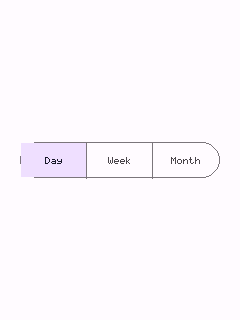

*Full sketch: [`examples/controls/segmented-button/segmented-button.ino`](../examples/controls/segmented-button/segmented-button.ino)*

### `Badge`

A small, non-interactive status marker - either a plain dot (no text set) or a filled pill holding a short count/label ("3", "9+"). Typically overlaid on the corner of another widget's bounds.

**Guidelines**

- Position it yourself over whatever it's badging (e.g. the top-right corner of an `IconButton`'s bounds) - `Badge` has no notion of an anchor widget, it just draws at its own `bounds`.
- Use the dot form for "something changed, no count available"; use the text form once a specific count is meaningful.

```cpp
// --- Badge (the control under test) -----------------------------------------
// Non-interactive - typically overlaid on a corner of another widget (e.g.
// an IconButton's bounds); shown centered on its own here.
Badge<RGB565> demoBadge(Bounds((kWidth - 24) / 2, (kHeight - 24) / 2, 24, 24), "5");

// setup():
screen.addWidget(demoBadge);
```

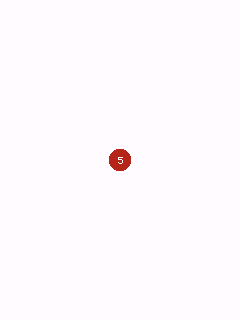

*Full sketch: [`examples/controls/badge/badge.ino`](../examples/controls/badge/badge.ino)*

---

## Progress & feedback

### `LinearProgressIndicator`

A horizontal progress bar, determinate (`value` in `[0,1]`) or indeterminate (a segment sweeps back and forth, driven by `update()`).

**Guidelines**

- Use determinate whenever real progress is knowable (a download's byte count); reserve indeterminate for genuinely unknown-duration waits.
- Indeterminate mode costs a redraw every frame it's visible - see `Widget::update()`'s dirty-tracking doc comment.

```cpp
// --- LinearProgressIndicator (the control under test) -----------------------
LinearProgressIndicator<RGB565> demoProgress(Bounds(20, (kHeight - 8) / 2, kWidth - 40, 8), 0.0f,
                                             /*indeterminate=*/true);

// setup():
screen.addWidget(demoProgress);
```

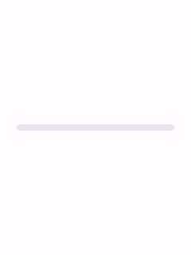

*Full sketch: [`examples/controls/linear-progress-indicator/linear-progress-indicator.ino`](../examples/controls/linear-progress-indicator/linear-progress-indicator.ino)*

### `CircularProgressIndicator`

A circular "spinner" ring - the same determinate/indeterminate split as `LinearProgressIndicator`, drawn as an arc via `ISurface::drawArc`.

**Guidelines**

- Prefer this over the linear form when horizontal space is tight but a compact square is available (e.g. centered over a loading screen).
- `setThickness()` controls the ring's stroke width independent of its diameter.

```cpp
// --- CircularProgressIndicator (the control under test) ---------------------
CircularProgressIndicator<RGB565> demoProgress(Bounds((kWidth - 48) / 2, (kHeight - 48) / 2, 48, 48),
                                               0.0f, /*indeterminate=*/true);

// setup():
screen.addWidget(demoProgress);
```

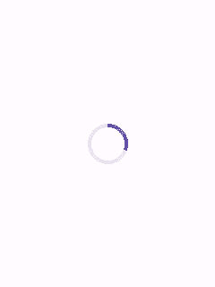

*Full sketch: [`examples/controls/circular-progress-indicator/circular-progress-indicator.ino`](../examples/controls/circular-progress-indicator/circular-progress-indicator.ino)*

### `Snackbar`

A transient bottom message bar with an optional single text action, that hides itself automatically after its duration. Not modal - add once with `Screen::addFixedWidget()` and drive its lifetime with `show()`/`dismiss()`.

**Guidelines**

- Use for a brief, non-blocking confirmation ("Saved", "Message deleted" + "Undo") - never for anything the user must act on before continuing (use `Dialog` for that).
- Starts invisible (`visible = false`) so an idle `Snackbar` costs nothing extra - `Screen` already skips invisible widgets.

```cpp
// --- Snackbar (the control under test) ---------------------------------------
Snackbar<RGB565> demoSnackbar(Bounds(16, kHeight - 64, kWidth - 32, 48));

// setup():
demoSnackbar.onAction = []() { printf("Snackbar action tapped\n"); };
screen.addFixedWidget(demoSnackbar);
demoSnackbar.show("Saved", "Undo");
```

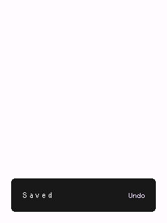

*Full sketch: [`examples/controls/snackbar/snackbar.ino`](../examples/controls/snackbar/snackbar.ino)*

### `Tooltip`

A small floating label shown briefly above an anchor widget. Not hover-driven (this library targets touchscreens) - call `showFor(anchorBounds, text)` yourself, typically from a long-press.

**Guidelines**

- Call `showFor()` only after the tooltip has been registered with `Screen` (it measures text using its own theme, which is only set once added) - as this example's comment notes.
- Keep the shown duration short (the default is 1.5s); a tooltip that lingers stops feeling like a hint.

```cpp
// --- Tooltip (the control under test) -----------------------------------------
Tooltip<RGB565> demoTooltip;

// setup():
// showFor() measures text using the theme, so the widget must already be
// registered (and so themed) with Screen before calling it.
screen.addFixedWidget(demoTooltip);
demoTooltip.showFor(Bounds(kWidth / 2 - 10, kHeight / 2 - 10, 20, 20), "Hint text",
                    /*durationMs=*/60000);
```

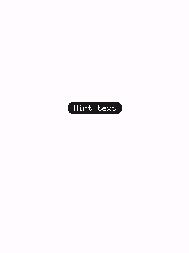

*Full sketch: [`examples/controls/tooltip/tooltip.ino`](../examples/controls/tooltip/tooltip.ino)*

### `Banner`

A persistent, non-modal inline message with up to 2 text actions - Material's "banner", e.g. pinned below an app bar for a system-level notice.

**Guidelines**

- Use for information that stays relevant until explicitly addressed ("You're offline") - unlike `Snackbar`, a `Banner` doesn't auto-dismiss.
- Toggle `visible` yourself (`Banner` isn't presented modally) - typically in response to whatever condition it's reporting on.

```cpp
// --- Banner (the control under test) -----------------------------------------
Banner<RGB565> demoBanner(Bounds(0, 48, kWidth, 80), "You're offline. Check your connection.");

// setup():
screen.addFixedWidget(demoBanner);
```

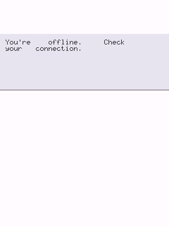

*Full sketch: [`examples/controls/banner/banner.ino`](../examples/controls/banner/banner.ino)*

---

## Containment

### `Card`

An elevated rounded-rect container with an optional title and word-wrapped body text - the general-purpose content container.

**Guidelines**

- Set `elevated = false` for a flat card when it sits inside another already-elevated surface (avoids stacking shadows).
- For a tappable, image-backed variant (station/genre tiles), use `MediaCard` instead.

```cpp
// --- Card (the control under test) ------------------------------------------
Card<RGB565> demoCard(Bounds(20, (kHeight - 140) / 2, kWidth - 40, 140), "TinyMaterialDesign",
                      "A simple elevated card with a title and word-wrapped body text.");

// setup():
screen.addWidget(demoCard);
```

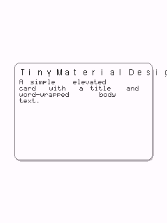

*Full sketch: [`examples/controls/card/card.ino`](../examples/controls/card/card.ino)*

### `MediaCard`

A tappable card with a thumbnail image and a caption - e.g. one tile in a grid of stations/genres. Pair with `GridLayout` (`Core/GridLayout.h`) to lay out several of these in a wrapping grid.

**Guidelines**

- The image is any `TinyGPU::ISurface<RGB_T>` you already have (a decoded BMP/JPEG, ...) - `MediaCard` only blits it via `drawSprite()`, it doesn't fetch or decode anything itself.
- There's no image scaling - pre-size the image to fit the card's image area before handing it to `setImage()`.

```cpp
// --- MediaCard (the control under test) ---------------------------------------
MediaCard<RGB565> demoMediaCard(Bounds((kWidth - 140) / 2, (kHeight - 140) / 2, 140, 140), "Jazz");

// setup():
demoMediaCard.onClick = []() { printf("Media card tapped\n"); };
screen.addWidget(demoMediaCard);
```

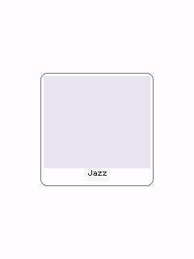

*Full sketch: [`examples/controls/media-card/media-card.ino`](../examples/controls/media-card/media-card.ino)*

### `ListItem`

A tappable row: optional leading icon + title, with a selected state. The building block for `Drawer`, but usable standalone for any settings-style list.

**Guidelines**

- Selected items draw as a filled pill (Material's navigation-drawer look); unselected items are flat.
- `setTypographyRole()` lets a dense list (many rows, e.g. inside a `Drawer`) use `kLabel` instead of the default `kBody`.

```cpp
// --- ListItem (the control under test) ---------------------------------------
ListItem<RGB565> demoListItem(Bounds(20, (kHeight - 48) / 2, kWidth - 40, 48), "Settings");

// setup():
demoListItem.onClick = []() { printf("List item tapped\n"); };
screen.addWidget(demoListItem);
```

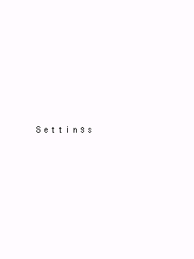

*Full sketch: [`examples/controls/list-item/list-item.ino`](../examples/controls/list-item/list-item.ino)*

### `Divider`

A themed hairline that separates content into sections. Orientation follows the bounds' aspect ratio: wider-than-tall draws horizontal, taller-than-wide draws vertical.

**Guidelines**

- Use sparingly - Material 3 leans on spacing and grouping over explicit rules; reach for a `Divider` mainly between logically distinct sections of a scrolling list.

```cpp
// --- Divider (the control under test) ---------------------------------------
Divider<RGB565> demoDivider(Bounds(20, (kHeight - 2) / 2, kWidth - 40, 2));

// setup():
screen.addWidget(demoDivider);
```

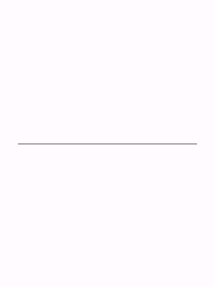

*Full sketch: [`examples/controls/divider/divider.ino`](../examples/controls/divider/divider.ino)*

### `Label`

Non-interactive themed text at one of four typography roles (`kHeadline`/`kTitle`/`kBody`/`kLabel`), left- or center-aligned.

**Guidelines**

- Pick the typography role for the text's semantic weight, not just its size - `kTitle` for section headers, `kBody` for regular copy, `kLabel` for compact captions/chips-adjacent text.
- `setColor()` overrides the default `onSurface` color when a label needs to stand out (a status message in the theme's error/primary color, say).

```cpp
// --- Label (the control under test) -----------------------------------------
Label<RGB565> demoLabel(Bounds(20, (kHeight - 24) / 2, kWidth - 40, 24), "Hello, Material Design!",
                        TypographyRole::kTitle, TextAlign::kCenter);

// setup():
screen.addWidget(demoLabel);
```

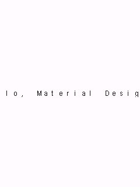

*Full sketch: [`examples/controls/label/label.ino`](../examples/controls/label/label.ino)*

---

## Navigation

### `AppBar`

A top app bar: a title plus optional leading/trailing icon widgets (typically `IconButton`), registered via `Screen::addFixedWidget()` so it stays pinned to the top regardless of scroll position.

**Guidelines**

- Attach `leading`/`trailing` directly as pointer fields (see `leadingRect()`/`trailingRect()`) - do **not** also add them to `Screen` separately, or they'd be hit-tested twice.
- Use `setColorOverride()` to recolor just the bar (e.g. to reflect the active theme's primary color) without affecting the rest of the screen.

```cpp
// --- AppBar (the control under test) -----------------------------------------
AppBar<RGB565> demoAppBar(Bounds(0, 0, kWidth, 48), "App Bar");

// setup():
screen.addFixedWidget(demoAppBar);
```

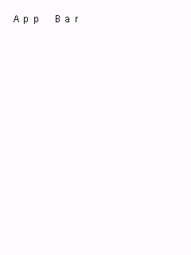

*Full sketch: [`examples/controls/app-bar/app-bar.ino`](../examples/controls/app-bar/app-bar.ino)*

### `TabBar`

A row of evenly-spaced exclusive-selection labels (primary tabs), with a sliding indicator under the selected one.

**Guidelines**

- Use for 2-5 top-level views of equally-important content within one screen; prefer `NavigationBar` for app-wide destinations instead of in-screen view switching.
- Tabs are plain strings added via `addTab()`, not separate child widgets - up to `TabBar::kMaxTabs`.

```cpp
// --- TabBar (the control under test) -----------------------------------------
TabBar<RGB565> demoTabs(Bounds(0, (kHeight - 40) / 2, kWidth, 40));

// setup():
demoTabs.addTab("One");
demoTabs.addTab("Two");
demoTabs.addTab("Three");
demoTabs.onChange = [](int index) { printf("Tab selected: %d\n", index); };
screen.addWidget(demoTabs);
```

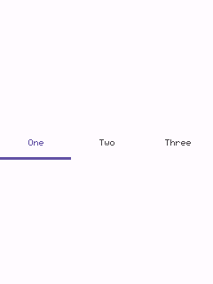

*Full sketch: [`examples/controls/tab-bar/tab-bar.ino`](../examples/controls/tab-bar/tab-bar.ino)*

### `NavigationBar`

A bottom navigation bar: 3-5 exclusive destinations, each an icon with a label underneath and a pill highlight behind the selected one. Pin it with `Screen::addFixedWidget()`.

**Guidelines**

- Use for an app's top-level, always-visible destinations (3-5 of them); for a tablet/landscape layout prefer `NavigationRail` instead.
- Keep labels short - they're drawn at the theme's `kLabel` typography role, meant for a word or two, not a phrase.

```cpp
// --- NavigationBar (the control under test) ----------------------------------
NavigationBar<RGB565> demoNavBar(Bounds(0, kHeight - 64, kWidth, 64));

// setup():
demoNavBar.addDestination(drawPlus<RGB565>, "Add");
demoNavBar.addDestination(drawMinus<RGB565>, "Remove");
demoNavBar.addDestination(drawMenu<RGB565>, "More");
demoNavBar.onChange = [](int index) { printf("Nav destination: %d\n", index); };
screen.addFixedWidget(demoNavBar);
```

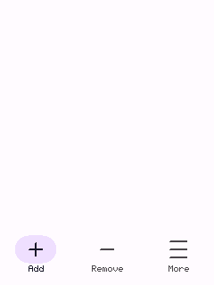

*Full sketch: [`examples/controls/navigation-bar/navigation-bar.ino`](../examples/controls/navigation-bar/navigation-bar.ino)*

### `NavigationRail`

A narrow vertical column of 3-7 exclusive destinations - the tablet/landscape counterpart of `NavigationBar`, pinned to a screen edge via `Screen::addFixedWidget()`.

**Guidelines**

- Use in place of `NavigationBar` on wider/landscape layouts where a side column reads more naturally than a bottom bar.

```cpp
// --- NavigationRail (the control under test) ---------------------------------
NavigationRail<RGB565> demoNavRail(Bounds(0, 0, 72, kHeight));

// setup():
demoNavRail.addDestination(drawPlus<RGB565>, "Add");
demoNavRail.addDestination(drawMinus<RGB565>, "Remove");
demoNavRail.addDestination(drawMenu<RGB565>, "More");
demoNavRail.onChange = [](int index) { printf("Nav destination: %d\n", index); };
screen.addFixedWidget(demoNavRail);
```

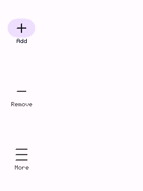

*Full sketch: [`examples/controls/navigation-rail/navigation-rail.ino`](../examples/controls/navigation-rail/navigation-rail.ino)*

### `Drawer`

A modal side navigation panel holding a list of items (typically `ListItem`), shown like a `Dialog` via `Screen::presentDialog()`.

**Guidelines**

- Use for an app's top-level navigation destinations, opened from an app bar's leading menu icon (see `kitchen-sink.ino`).
- Wire `onScrimTap` to `screen.dismissDialog()` for tap-outside-to-close, and dismiss from each item's own `onClick` too.

```cpp
// --- Drawer (the control under test) -----------------------------------------
Drawer<RGB565> demoDrawer(Bounds(0, 0, 220, kHeight));
ListItem<RGB565> drawerItem;

// setup():
drawerItem = ListItem<RGB565>(demoDrawer.itemRect(0), "Home");
drawerItem.setSelected(true);
drawerItem.onClick = []() {
  printf("Drawer item tapped\n");
  screen.dismissDialog();
};
demoDrawer.addItem(drawerItem);
demoDrawer.onScrimTap = []() { screen.dismissDialog(); };

// Shown immediately (no separate trigger control) - see Screen::presentDialog().
screen.presentDialog(demoDrawer);
```

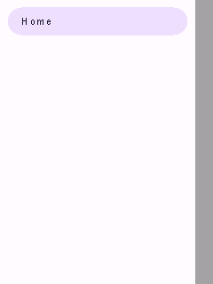

*Full sketch: [`examples/controls/drawer/drawer.ino`](../examples/controls/drawer/drawer.ino)*

### `Menu`

A popover list of items (typically `ListItem`), anchored near whatever opened it. Same modal-presentation shape as Dialog/Drawer, but - unlike them - does **not** dim the rest of the screen, since a menu is a lightweight popover, not a heavyweight interruption.

**Guidelines**

- Use for a small, contextual set of choices (a dropdown from a Button, a long-press context menu) - for full-screen navigation use `Drawer` instead.
- Wire `onOutsideTap` to `screen.dismissDialog()` for the expected tap-outside-to-close behavior.

```cpp
// --- Menu (the control under test) -------------------------------------------
Menu<RGB565> demoMenu(Bounds((kWidth - 160) / 2, (kHeight - 40) / 2, 160, 40));
ListItem<RGB565> menuItem;

// setup():
menuItem = ListItem<RGB565>(demoMenu.itemRect(0), "Option 1");
menuItem.onClick = []() {
  printf("Menu item tapped\n");
  screen.dismissDialog();
};
demoMenu.addItem(menuItem);
demoMenu.onOutsideTap = []() { screen.dismissDialog(); };

// Shown immediately (no separate trigger control) - see Screen::presentDialog().
screen.presentDialog(demoMenu);
```

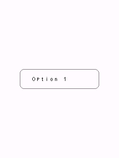

*Full sketch: [`examples/controls/menu/menu.ino`](../examples/controls/menu/menu.ino)*

### `Dialog`

A modal alert: full-screen scrim + centered card + title + wrapped message + up to 2 action widgets (typically `Button`). Shown with `Screen::presentDialog()`.

**Guidelines**

- Always give a Dialog at least one action wired to `screen.dismissDialog()` - without one there's no way for the user to close it (this example omits that follow-up wiring for brevity beyond the one OK action shown).
- Reserve dialogs for choices that truly need to interrupt the user - for a transient, non-blocking status message use `Snackbar` instead.

```cpp
// --- Dialog (the control under test) -----------------------------------------
Dialog<RGB565> demoDialog(Bounds(20, (kHeight - 160) / 2, kWidth - 40, 160), "Hello",
                          "This is a simple modal dialog with one action.");
Button<RGB565> dialogOk(Bounds(0, 0, 80, 36), "OK");

// setup():
dialogOk.bounds = demoDialog.actionRect(0, 1);
dialogOk.onClick = []() {
  printf("Dialog OK tapped\n");
  screen.dismissDialog();
};
demoDialog.addAction(dialogOk);

// Shown immediately (no separate trigger control) - see Screen::presentDialog().
screen.presentDialog(demoDialog);
```

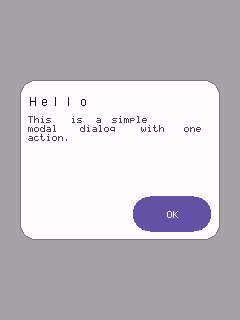

*Full sketch: [`examples/controls/dialog/dialog.ino`](../examples/controls/dialog/dialog.ino)*

### `BottomSheet`

A modal panel sliding up from the bottom edge, full width, with rounded top corners and a drag-handle bar - Material's "modal bottom sheet". Holds a list of items the same non-owning way `Drawer` holds its items.

**Guidelines**

- Use for a focused set of actions/options related to the current context (a share sheet, a "more options" panel) - prefer `Dialog` for a yes/no-style interruption instead.
- `itemRect()` is theme-independent by design, so items can be constructed at global scope before the sheet has ever been given a theme - the same pattern `Drawer::itemRect()` uses.

```cpp
// --- BottomSheet (the control under test) ------------------------------------
BottomSheet<RGB565> demoSheet(Bounds(0, kHeight - 160, kWidth, 160), "Options");
ListItem<RGB565> sheetItem;

// setup():
sheetItem = ListItem<RGB565>(demoSheet.itemRect(0), "Share");
sheetItem.onClick = []() {
  printf("Bottom sheet item tapped\n");
  screen.dismissDialog();
};
demoSheet.addItem(sheetItem);
demoSheet.onScrimTap = []() { screen.dismissDialog(); };

// Shown immediately (no separate trigger control) - see Screen::presentDialog().
screen.presentDialog(demoSheet);
```

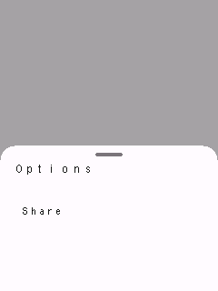

*Full sketch: [`examples/controls/bottom-sheet/bottom-sheet.ino`](../examples/controls/bottom-sheet/bottom-sheet.ino)*

---

## Text input

### `TextField`

A single-line text input box. Only holds and displays text and focus state - it has no idea how to turn touches into characters; pair with `Keyboard` (see that example) for actual typing.

**Guidelines**

- Wire a `Keyboard` via `keyboard.manage(field)` to let the user actually type - a lone `TextField` (as shown here) can still be focused/tapped, but nothing routes keystrokes into it.
- Text longer than the box draws past its right edge rather than scrolling/clipping - fine for short inputs, not for long free-form text (use `TextArea` for that).

```cpp
// --- TextField (the control under test) ---------------------------------------
// Tap to focus (a blinking cursor appears); pair with a Keyboard (see the
// keyboard example) to actually type into it.
TextField<RGB565> demoField(Bounds(20, (kHeight - 48) / 2, kWidth - 40, 48), "Name", "Your name");

// setup():
demoField.onSubmit = []() { printf("Submitted: %s\n", demoField.text().c_str()); };
screen.addWidget(demoField);
```

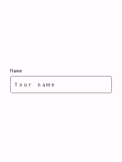

*Full sketch: [`examples/controls/text-field/text-field.ino`](../examples/controls/text-field/text-field.ino)*

### `TextArea`

The multi-line, word-wrapped counterpart to `TextField` - same `TextInputTarget` interface, same need for a `Keyboard` to drive actual typing.

**Guidelines**

- Use for longer free-form text (notes, descriptions); use `TextField` for short single-line values (names, search terms).
- On a `Keyboard`, Enter inserts a literal newline here (unlike `TextField`, where Enter submits) - Done still closes the keyboard regardless of field type.

```cpp
// --- TextArea (the control under test) ---------------------------------------
// Tap to focus (a blinking cursor appears); pair with a Keyboard (see the
// keyboard example) to actually type into it.
TextArea<RGB565> demoArea(Bounds(20, (kHeight - 140) / 2, kWidth - 40, 140), "Notes",
                          "Write something...");

// setup():
screen.addWidget(demoArea);
```

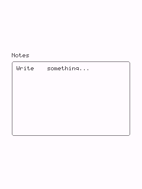

*Full sketch: [`examples/controls/text-area/text-area.ino`](../examples/controls/text-area/text-area.ino)*

### `SearchBar`

A pill-shaped search input: leading magnifier glyph, typed text, and a trailing "x" clear glyph shown once there's something to clear. Implements `TextInputTarget` the same way `TextField` does.

**Guidelines**

- Pair with a `Keyboard` (via `manage()`) for actual typing, same as `TextField`/`TextArea` - omitted here to keep this a single-control demo.
- The trailing clear glyph only appears once `text()` is non-empty, and tapping it clears the field without needing a separate button.

```cpp
// --- SearchBar (the control under test) ---------------------------------------
// Tap to focus (a blinking cursor appears); pair with a Keyboard to
// actually type into it - omitted here to keep this a single-control demo.
SearchBar<RGB565> demoSearch(Bounds(20, (kHeight - 48) / 2, kWidth - 40, 48), "Search");

// setup():
demoSearch.onSubmit = []() { printf("Search submitted: %s\n", demoSearch.text().c_str()); };
screen.addWidget(demoSearch);
```

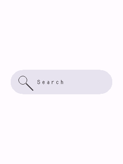

*Full sketch: [`examples/controls/search-bar/search-bar.ino`](../examples/controls/search-bar/search-bar.ino)*

### `Keyboard`

An on-screen QWERTY keyboard that drives one text input (`TextField` or `TextArea`) at a time. A single instance can serve any number of fields via `manage(field)`.

**Guidelines**

- Add it to `Screen` *after* every field it manages, so it draws (and hit-tests) on top of them while shown.
- Enter and Done are deliberately separate: Enter always inserts a literal newline; Done always means "finished editing" and hides the keyboard.
- This example forces it visible directly (no managed field) purely to keep it a single-control demo - keys still respond, they just have nowhere to insert characters.

```cpp
// --- Keyboard (the control under test) ---------------------------------------
// Normally shown/targeted via a TextField's/TextArea's onFocus (see
// Keyboard::manage()); forced visible here directly so this stays a
// single-control demo - keys still respond, they just have no field to
// insert characters into.
Keyboard<RGB565> demoKeyboard(Bounds(0, kHeight - 190, kWidth, 190));

// setup():
demoKeyboard.visible = true;
screen.addFixedWidget(demoKeyboard);
```

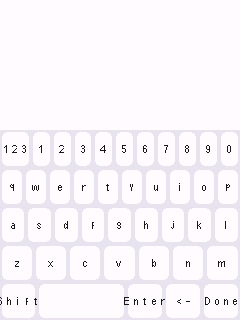

*Full sketch: [`examples/controls/keyboard/keyboard.ino`](../examples/controls/keyboard/keyboard.ino)*

---


## Building and running the examples

```sh
cmake -B build -S .
cmake --build build --target button   # or any other control's directory name
./build/examples/controls/button/button
```

See [`examples/kitchen-sink`](../examples/kitchen-sink) for all of the
original widgets combined into one scrollable screen, and
[`examples/controls/README.md`](../examples/controls/README.md) for the full
one-sketch-per-widget list.
